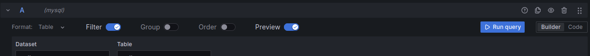
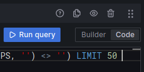
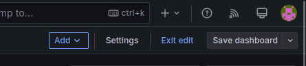
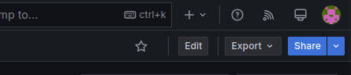
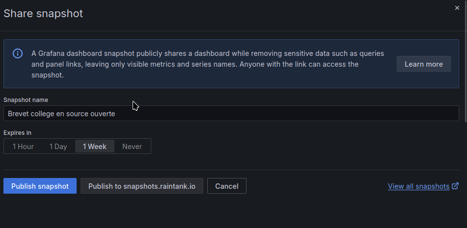

# Dashboard

Dans la partie graphique, j'ai fait une allusion à grafana pour générer des tableaux de bord.
Voyons ensemble comment faire pour avoir son petit serveur grafana perso.

!!! question
    Pourquoi pas PowerBi ou Tableaux ? Une seule reponse, c'est pas libre. (Et oui, je suis un libriste).

Pour ce faire, nous allons utiliser MariaDB(base de données SQL ) et Grafana.

## Podman et podman-compose

Podman et podman-compose sont déjà décrit dans la [session réseaux.](../reseaux/podman.md).

Nous allons donc créer un fichier docker-compose.yml :
```bash
touch docker-compose.yml
nano docker-compose.yml
```

```yaml
volumes:
  grafana:
  data:
services:
  grafana:
    image: registry.hub.docker.com/grafana/grafana-oss:latest
    container_name: grafana
    env_file: "grafana.env"
    restart: unless-stopped
    volumes:
      - grafana:/var/lib/grafana
    networks:
      - grafanaV6
    ports:
     - '4000:3000'
  db:
    image: docker.io/mariadb
    env_file: "db.env"
    restart: unless-stopped
    volumes:
      - data:/var/lib/mysql
    networks:
      - grafanaV6
    ports:
      - "3306:3306"
networks:
  grafanaV6:
    driver: bridge
```

Dans ce fichier, vous pouvez voir 2 fichiers de configurations en .env .
Créez les vôtres.

```bash
touch grafana.env
nano grafana.env
```

```yaml
GF_SERVER_ROOT_URL=Votre_url_pour_grafana
GF_SERVER_SERVE_FROM_SUB_PATH=true #si vous utilisez un subpath mettre true sinon false
GF_SERVER_ENABLE_GZIP=true # active la compression Gzip du serveur
```

```bash
touch db.env
nano db.env
```

```yaml
MYSQL_ROOT_PASSWORD=Mot_de_passe_principal_mariaDB
MYSQL_PASSWORD=Mode_de_passe_user
MYSQL_USER=Nom_user
MYSQL_database=Nom_BDD
```

Nous devons maintenant démarrer les containers avec la commande :

```bash
podman-compose up -d
```

Normalement, vous pouvez accéder à grafana sur l'adresse [127.0.0.1:4000](http://127.0.0.1:4000){target="_blank"} (sauf si vous avez mis [d'autres reglages](https://grafana.com/docs/grafana/latest/setup-grafana/configure-grafana/){target="_blank"}).

Entrez le mot de passe et commencez à utiliser grafana. (configuration de la connexion à la base de données par exemple.)
!!! tips 
    L'adresse de la base de données mariadb dans grafana est db:3306 . db étant le nom dans le DNS du réseau podman et 3306 est le port par défaut.

## Systemd pour automatiser le démarrage

Les containers, c'est bien. Mais podman ne démarre pas automatiquement les containers au démarrage. (Et les pannes de courant existent surtout chez moi).
2 solutions :

- L'onduleur avec batteries comme ça le serveur ne redémarre jamais. (Enfin, des fois, il faut, mais vous le redémarrez et relancer le serveur à la main.)
- Faire en sorte de redémarrer podman

On part sur la deuxième solution.

On va partir sur systemd (qui mériterais un paragraphe aussi)

Allez sur le serveur dans /etc/systemd/system

Créez un fichier truc.service puis configurez le :
Remplacer truc par un nom signifiant quelque chose. dashboard par exemple.

```bash
touch /etc/systemd/system/truc.service
nano /etc/systemd/system/truc.service
```

Vérifiez le chemin vers podman-compose :

```bash
which podman-compose
```

```docker
[Unit]
Description=redemarre Grafana
After=network.target

[Service]
Type=oneshot
RemainAfterExit=true
ExecStart=/usr/bin/podman-compose --file chemin_vers_votre_docker-compose up -d
ExecStop=/usr/bin/podman-compose --file chemin_vers_votre_docker_compose down
User=votre_user

[Install]
WantedBy=multi-user.target

```

!!! warning
    N'oubliez pas de changer le chemin vers docker-compose.yml et aussi le chemin vers podman-compose.

Il n'y a plus qu'à démarrer le service avec la commande systemctl start et activé le démarrage auto avec systemctl enable

```bash
sudo systemctl start truc.service
sudo systemctl enable truc.service
```

## Faire son dashboard

Il suffit de faire 2 choses :

1. Avoir une base de données ou remplir sa base de données
1. Faire son tableau de bord

Pour remplir sa base de données, je vous renvoie vers le [SQL](sql.md).
Pour faire son tableau de bord, je vous renvoie dans la partie [monitoring](../reseaux/monitoring.md)

Il ne vous reste plus qu'à faire des requêtes à votre BDD et créer de beaux dashboards.

!!! tips
    Grafana par défaut met une limite aux 50 premiers résultats. Cliquez sur code puis supprimer la limite à la fin de la requête. 





## Faire sortir son dashboard
Pour faire sortir son dashboard, c'est facile. Il suffit de sortir du mode édition en cliquant sur **exit edit** en haut à gauche. 



Puis sur la flèche à côtés de share en toujours en haut à gauche.



Et sélectionnez snapshot. Puis décidez de mettre ça sur snapshot.ranktank.io


Vous pouvez configurer le partage (durée, Nom).

!!! question
    C'est sympa, mais j'ai des données sensibles. Je voudrais que seulement mes collègues puissent se connecter et voir mes tableaux de bord.

Pour ce faire, on va passer va configurer nginx et grafana.

## Connectez son grafana à internet.

Alors premièrement, il vous faut un nom de domaine, un certificat SSL, grafana et nginx.

Plus haut, je vous ai parlé de grafana.env pour le docker/podman qui modifie la configuration de grafana.ini avec des variables d'environnement.

Il faut en configurer certaine. Alors au minimum :

- GF_SERVER_ROOT_URL : chemin d'accès à votre grafana (par exemple https://mon_site/grafana)
- GF_SERVER_SERVE_FROM_SUB_PATH : True si vous avez un subpath (Attention ligne à commenter, ce n'est plus valide avec les versions 10 et plus)

Mais aussi d'autre pour plus de sécurité par exemple :

- GF_SERVER_ENFORCE_DOMAIN : true pour eviter les attaques par dns rebinding

Une fois, cela fait, il faut configurer l'accès à Internet. Je passe par nginx.

Ajoutons ça au nginx.conf dans la session http

```nginx
    upstream grafana {
      server localhost:4000; # configurer le chemin d'accès
        }
        # Session server de votre site avec le SSl
        [...]
        location /grafana {
                proxy_set_header Host $host;
                proxy_pass http://grafana;
                }
        location /grafana/api/live/ {
                proxy_http_version 1.1;
                proxy_set_header Upgrade $http_upgrade;
                proxy_set_header Connection $connection_upgrade;
                proxy_set_header Host $host;
                proxy_pass http://grafana;
                }
        [...]
```

Il est possible que grafana bugue avec le passage par un reverse proxy comme nginx. (appuyer sur f12 puis la session réseaux recharger la page des erreurs 206 peuvent apparaître)
Rajoutez ces 2 lignes dans la session http :

```nginx
    proxy_buffering off;
    proxy_max_temp_file_size 0;
```

Ceci est inspirée du [tuto de grafana](https://grafana.com/tutorials/run-grafana-behind-a-proxy/){target="_blank"} pour passer par reverse proxy.

Une fois votre grafana accessible par Internet. Vous pouvez maintenant configurer de plusieurs façons vos accès.

Par la session administration, crée des rôles viewers pour vos collègues.

Par ce rôle, vous leur accordez un droit de vue sur vos tableaux de bord.(il faudra qu'il passe par la connexion.).

Vos collègues ne veulent pas de mots de passe ni de compte (avouez, vous voulez les tuer).

Vous pouvez faire un lien interne ou un snapshot.

Les liens externes sont possibles aussi (mais n'importe qui avec le lien peut accéder).

Avec le [firewall](../reseaux/firewall.md){target="_blank"}, vous autorisez ou non l'accès au site avec leurs adresses IP, et snapshot non pas sur rank.io mais bien sur votre session (possibilité de le faire du firewall avec nginx).

!!! warning
    Cliquez bien sur **Publish snapshot**
    


Si le firewall est bien configuré seul ceux dont les adresse IP sont autorisé peuvent acceder au snapshot ou au lien externe.

exemple : le lien suivant vous montre un snapshots sur le pi5 chez moi passant par nginx : [https://www.barrmath.ovh/grafana/dashboard/snapshot/PbWtzoZ56pmkhYnj8AqyQpYuhoKf2pFn](https://www.barrmath.ovh/grafana/dashboard/snapshot/PbWtzoZ56pmkhYnj8AqyQpYuhoKf2pFn){target="_blank"}

D'autre infos sur grafana avec un exemple : [ETL + grafana](etl_dashboards.md){target="_blank"}