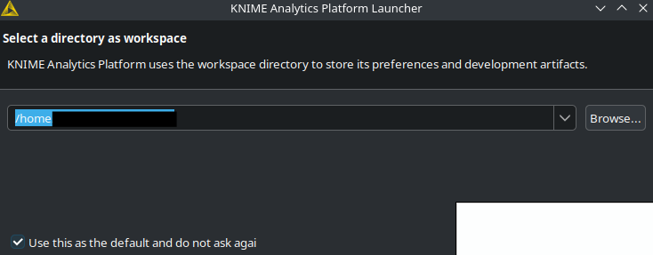
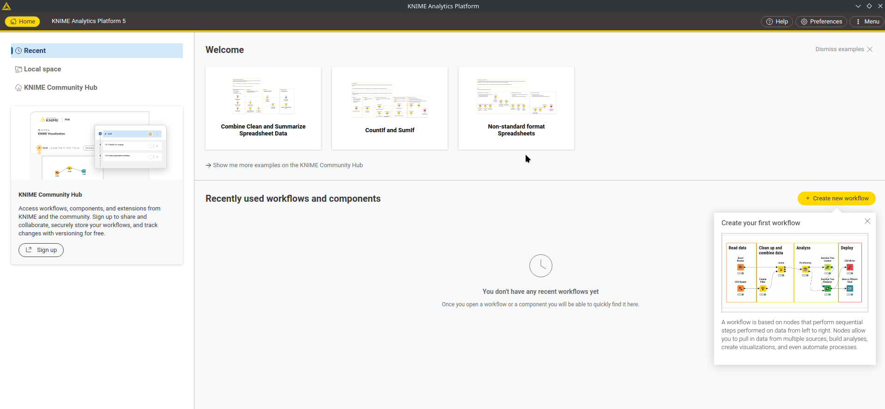
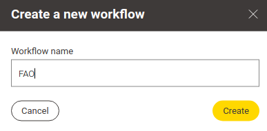
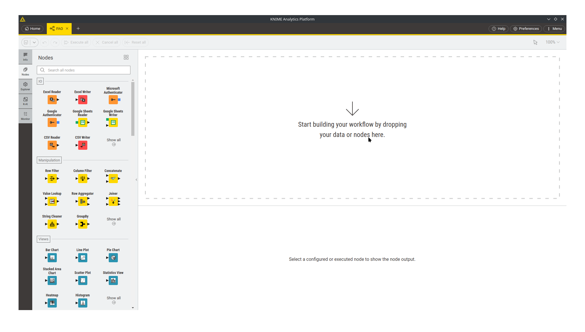
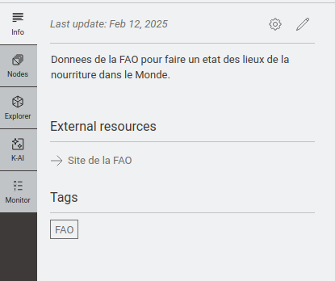
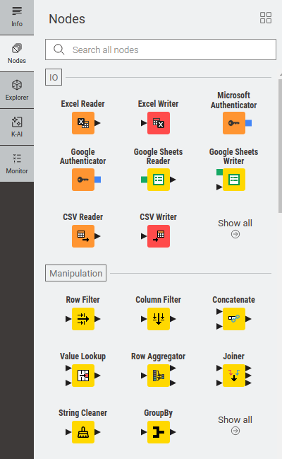
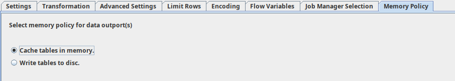
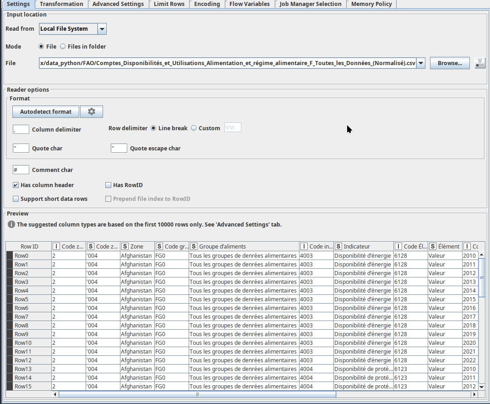
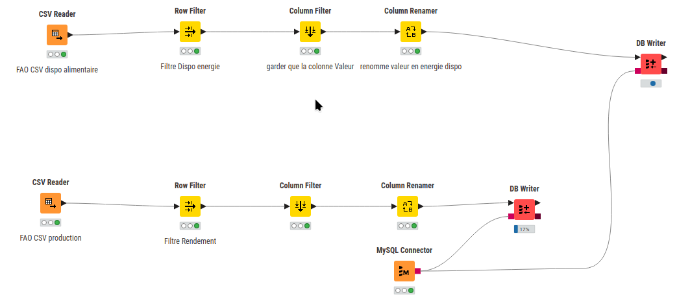
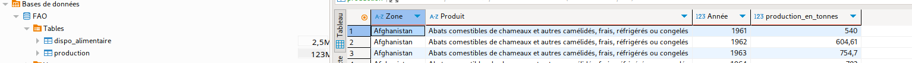

# ETL

## Intro

Pandas et python sont bien, mais quelquefois un logiciel qui vous évite des lignes de codes, c'est mieux. Parlons des ETL. Un ETL va charger les données, les transformer et les charger vers une autre source.

Par exemple, voulez sur un site internet avoir un accès à des KPI (Key Performance Indicators ou traduction : chiffre clé) Homme/Femme. Vous n'allez pas mettre les données de toute la RH sur le site (RGPD). Vous allez vouloir compiler directement les KPI puis mettre à jour la base de données. (en vous assurant que les données soient le plus anonyme possible)

Il existe plusieurs logiciels de type ETL sur le marché :

- PowerBI avec son [data power Flow](https://learn.microsoft.com/fr-fr/power-bi/transform-model/dataflows/dataflows-introduction-self-service){target="_blank"}
- Tableaux et son [data prep](https://www.tableau.com/fr-fr/products/prep){target="_blank"}
- [Luigi](https://luigi.readthedocs.io/en/stable/){target="_blank"} en mode python
- [Apache NIFI](https://nifi.apache.org/){target="_blank"}
- [Knime](https://www.knime.com/){target="_blank"}

Pourquoi Knime :

1. Logiciel open-source fonctionnant sous Linux. Donc on supprime PowerBi et Tableaux.
2. Simple d'utilisation en mode graphique : Pas de Luigi donc.
3. Simple d'installation : Knime s'installe sous windows avec juste un installateur, et des paquets sont disponibles dans les distributions Linux.

Il n'y a pas de mauvais ETL. Juste que celui-ci est le mieux pour moi.

## Knime

### Premier lancement

Au lancement, Knime vous demande un dossier ou mettre ces artefacts (on peut traduire ça par fichiers).

Selectionnez un dossier, cliquez sur suivant et voici Knime:

Appuyez sur create **new workflow**

Une fenêtre s'ouvre, nommez votre workflow (votre projet).

Mon projet installation ici est de transformer des fichiers de la [FAO](https://www.fao.org/home/fr){target="_blank"} et de les mettre dans ma base de données MariaDB.

Ensuite voir avec Grafana pour faire un mini-tableaux de bord avec des cartes et des filtres. On verra ce qui est possible avec mon petit serveur. Commençons par créer son premier workflow.

### Workflow

La fenêtre de Knime se présente comme ceci :

Regardez à droite et cliquez sur **info**.

Remplissez les informations générales du projet.(nom, description ...)

Maintenant, on va enfin pouvoir travailler.

Regardez la session **Nodes** à gauche.

Si vous utilisez des grosses données qui dépassent votre ram, vous pouvez changer le mode dans l'onglet **memory policie**.

Vous trouverez plein de boite (Nodes) pour faire ce que vous voulez. (lire des fichiers excel csv, des connecteurs de base de données, des filtres, ...)

Par exemple : Glisser/deposer **csv-reader** dans la zone pipeline et cliquez sur l'engrenage pour le configurer.

Vous devriez avoir une fenêtre comme ça :

Vous pouvez configurer et faire glisser/déposer/configurer les différents Nodes pour arriver à construire votre pipeline.

.

Lancez le workflow et regardez si votre base de données se remplie bien par exemple avec DBeaver.

