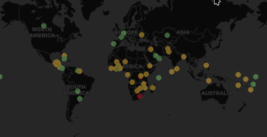
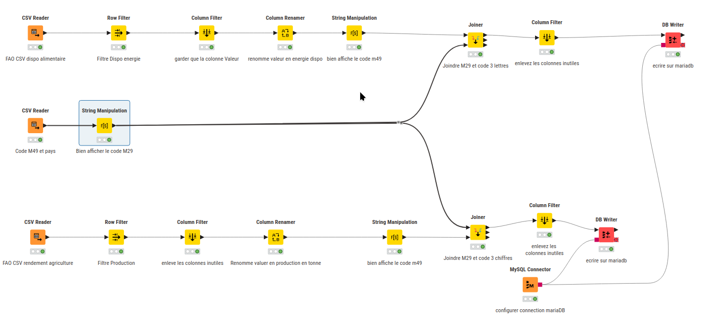
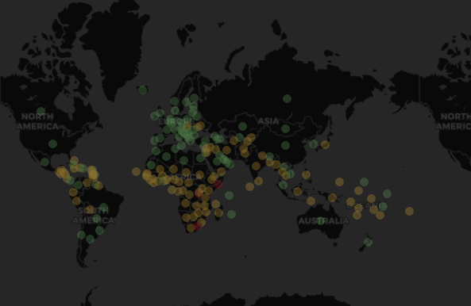
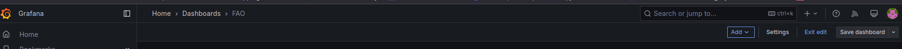
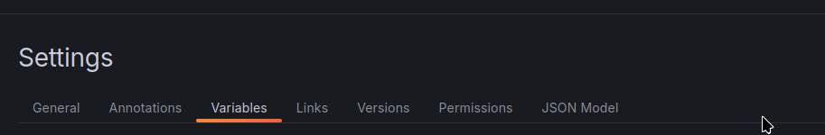
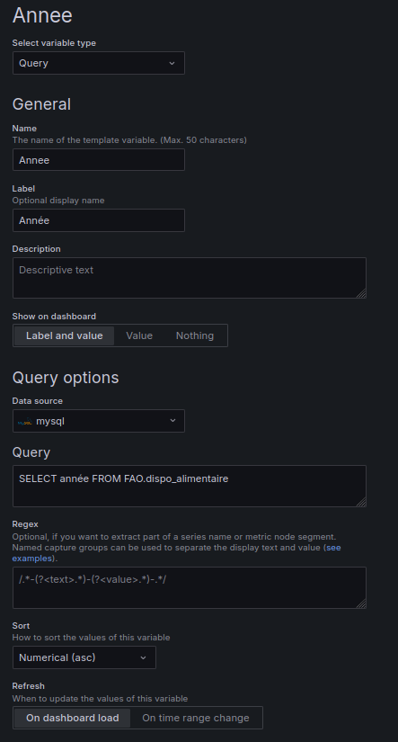
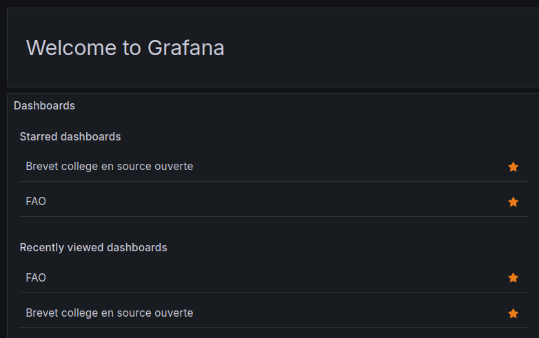

# Dashboard et ETL exemple les données de la FAO

## La FAO et ces données

La [FAO](https://www.fao.org/home/fr){target="_blank"} est une organisation des Nations Unis ayant pour but d'en finir avec la faim dans le monde.

Elle donne accès à [différentes données](https://www.fao.org/faostat/fr/#data){target="_blank"} dans le cadre de son action.

Le but ici est d'avoir des cartes mondiales et de pouvoir suivre l'évolution d'un pays vers une autonomie alimentaire.

Pour cela, j'utilise la disponibilité alimentaire, et les productions du pays.

## Infrastructure

Pour faire ce travail, j'ai besoin de grafana pour faire le tableau de bord et d'une base de données.

Je le fais avec 2 Containeurs :

- grafana : qui servira de créateur de dashboard et de diffuseur
- MariaDB : qui sert de base de données

Pour cela j'utilise podman avec ce depot : [https://github.com/barrmath/piweb2-grafana](https://github.com/barrmath/piweb2-grafana){target="_blank"}

Rappel :

- [utilisation de Git](../programmation/git.md){target="_blank"}
- [utilisation de docker-compose](../reseaux/docker-compose.md){target="_blank"}

## Transformation des données 1

Dans la partie [ETL](etl.md){target="_blank"}, on avait déjà une sortie vers une base de données.
Les fichiers ont eu différents traitements :

Fichier disponibilité alimentaire et production :

- Filtrer des lignes pour n'avoir que les informations nécessaire.
- enlever des colonnes
- changer le nom des colonnes pour avoir un nom plus parlant.
- mettre les données sur une BDD (ici mariaDB)

Les données sont bien transmisse commençons notre tableau de bord.

## Affichage des données (Dashboard grafana)

Si vous ne connaissez pas grafana : Utilisation de [grafana](dashboards.md){target="_blank"}.

On a un outil pour faire des cartes dans grafana [Geomap](https://grafana.com/docs/grafana/latest/panels-visualizations/visualizations/geomap/){target="_blank"}.

Premier résultat :

Zut, il manque des pays.

On vérifie la base de données. Les pays sont bien en base.

## Transformation des données 2

Les données sont en français (et les nom des pays aussi.)
On a supprimé des colonnes, dont une qui s'appelle "code Zone M49".

Les pays changent de noms plusieurs fois au cours du temps (exemple: La Gaule, le royaume de France, France). Les Nations unies ont créé un code M49 pour pouvoir avoir un suivi au cours du temps.

GEOmap reconnaît les codes 3 lettres pour les pays donc il suffit de trouver un [fichier](https://unstats.un.org/unsd/methodology/m49/){target="_blank"} qui fait la "traduction".

Donc mise à jour du traitement de données :

On utilise la colonne code M49. Les fichiers ayant certains défauts, j'ai dû modifier le M49 code dans le pipeline (2 devient 002 par exemple). Les 2 fichiers subissent différents traitements. (filtrage de ligne renommage de colonne etc.) Et ils sont ensuite transférés dans la BDD.

## Affichage des données 2

On recommence avec grafana, résultat avec la colonne des noms à 3 lettres :

Hourra, tous les pays ont l'air d'être là.

On pourrait faire autrement, un shapefile avec les coordonnées des pays par exemple. Si vous voulez travailler avec des régions ou des quartiers en France, les [données IRIS](https://www.insee.fr/fr/information/2017372){target="_blank"} de l'INSEE peuvent vous servir.

### Les variables dans grafana

Alors ils sont sympas ces tableaux statiques. Mais un peu d'interactivité serait un plus.
Cliquez sur **settings** en haut à droite.

Puis **variables**

et créez et remplissez la variable par exemple :

Félicitations, vous avez créé votre première variable.

Pour l'utiliser, il suffit d'utiliser le symbole du dollar $.

par exemple :

Dans un titre : **Disponibilité alimentaire dans le monde en $Annee**
Dans une requete :SELECT * FROM FAO.dispo_alimentaire WHERE `Année` = $Annee

!!! Warning
    Les variables ne sont pas utilisable avec les snapshots et les partages de dashboard.
    Le seul moyen est de créer un compte viewer et que le client se connecte sur Grafana.

Plus d'information sur les variables [ici.](https://grafana.com/docs/grafana/latest/dashboards/variables/){target="_blank"}

## Résultats final

Vous pouvez voir un tableaux grafana à cette adresse : [www.barrmath.ovh/grafana](https://www.barrmath.ovh/grafana){target="_blank"}

login : viewer
mot de passe : 1234

!!! Warning
    Ne pas mettre 1234 en mots de passe. Bon ici tout le monde peut avoir accès, c'est presque fait exprès.

Cliquez sur **FAO** dans starred Dashboard.

snapshot pour voir la non disponibilités des variables dans ce mode de partage: [https://www.barrmath.ovh/grafana/dashboard/snapshot/75vtpQTeJO86Cf1Zo8PbgO1OLDMbo94j](https://www.barrmath.ovh/grafana/dashboard/snapshot/75vtpQTeJO86Cf1Zo8PbgO1OLDMbo94j){target="_blank"}
