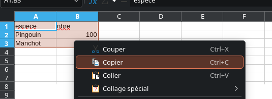
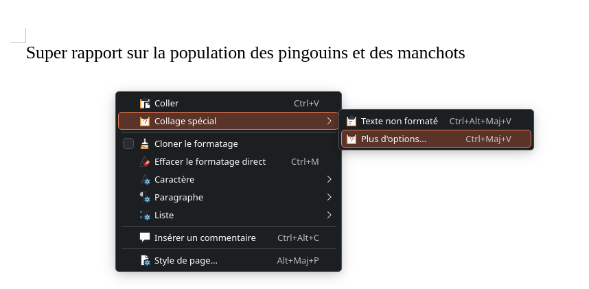
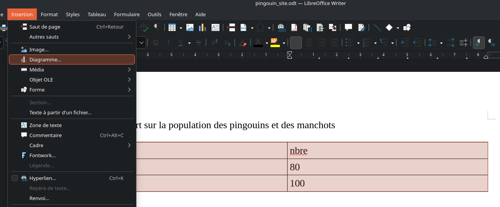
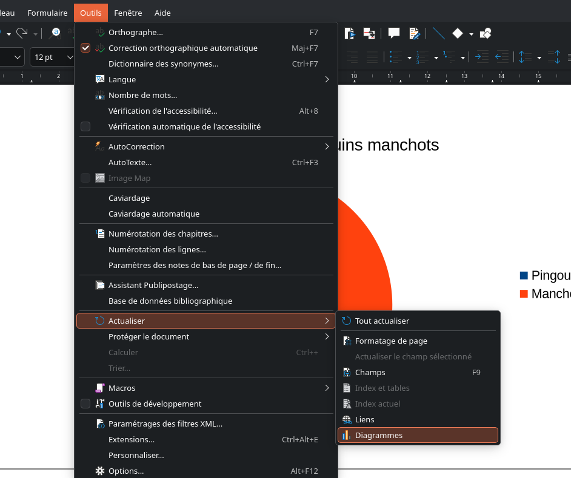

# Libre office

Pourquoi utiliser libre office ? Alors que l'on a des ETL, des dataviz, du python ?

Parce que des fois, c'est le seul outil qu'on a.

Mais on peux dejà utiliser libre office pour automatis,er des rapports. (faute de mieux).

## Libre office writer

Concurent de Word, writer peut prendre des données dans des tableaux calc ou excel via les liens DDE

Petit tuto rapide :

Imaginons un tableau comme ceci :

| espece | nbre |
| :--- | :--- |
| Pingouin | 100 |
| Manchot | 100 |

Et vous voulez juste faire un rapport dont le graphe va changer en fonction des valeurs du tableau.

Dans le document excel faite un copier sur les valeurs.

Dans votre document writer faite un collage special DDE :

Un tableau est maintenant mis dans votre document writer.
Si vous changez les valeurs dans votre tableur les valeurs change aussi dans le document writer.

Maintenant, vous voulez un graphe qui change ?

Vous pouvez le faire directement dans writer.

Selectionnez le tableau precedamment crée via des liens DDE puis insertion graphe :

Selectionnez ensuite de type de diagramme etc ...

Maintenant vous avez un beau diagramme :

Faites un test : changer par exemple le nombre de piilsngouin de 80 à 120 dans le document excel.

Le tableau change (ou pas) mais pas le diagramme dans writer.

2 solutions, soit fermer et relancer writer.
OU 
Outil-> Actualisation -> Diagramme ou tout actualiser.

Votre diagramme devrait se mettre à jour.

!!!warning
    Si vous rajouter des lignes ou des colonnes, il faut refaire la manipulation

!!! tips
    vous pouvez aussi utiliser des objets OLE avec insertion objet OLE et bien cocher lier au fichier.
    Attention cependant á l'affichage dans le document writer
