# SQL

Ce langage permet de faire des demandes à une base de données relationnelles.
Pour vulgariser, je vais faire un parallèle avec un tableur connu Excel.
Je reviendrai en conclusion sur les différences (assez importantes) entre une base de données et un simple fichier Excel.

Les bases de données sont constituées des éléments suivants :

1. Le Gestionnaire de Bases de Données (GBDD)
1. La Base De Données (BDD)
1. Les Tables
1. Les Colonnes

Pour faire le parallèle : le gestionnaire est le programme Excel, la base de données est un fichier Excel, les tables des feuilles de calcul et les colonnes, les colonnes.
Avant de faire du SQL, il faut donc au minimum installée un Gestionnaire de base de données. On peut installer ceux-ci en local, par conteneur ou en louer sur le cloud.

## Le gestionnaire de Base de données

Il existe 2 types de gestionnaire de bases de données, les SQL et les autres.
On peut citer par exemple [MongoDB](https://www.mongodb.com/fr-fr){target="_blank"}
, [Apache Hbase](https://hbase.apache.org/){target="_blank"} en tant que base de données noSQL.
Les gestionnaires de bases de données SQL les plus couramment utilisés sont :

- [SQL lite](https://www.sqlite.org/){target="_blank"} : pour des petits projets ou le développement
- [mySQL](https://www.mysql.com/fr/){target="_blank"} : une des plus connues
- [MariaDB](https://mariadb.org/){target="_blank"} : une BDD open source basée sur mySQL
- [Microsoft SQL server](https://www.microsoft.com/fr-fr/sql-server/sql-server-downloads){target="_blank"} : Une base de données de Microsoft
- [PostgreSQL](https://www.postgresql.org/){target="_blank"} : une autre base de données open source très performante

Toutes ces gestionnaires de bases de données existent souvent en version cloud.
Les fournisseurs cloud peuvent vous fournir leurs propres gestionnaires de bases de données.
Par exemple : [Aurora](https://aws.amazon.com/fr/rds/aurora/?nc2=h_ql_prod_db_aa){target="_blank"}
chez aws, [Cloud SQL](https://cloud.google.com/sql/){target="_blank"} pour gcp, ...
Pour la suite, je prends exemple sur mariaDB.

### Installation

Pour les Debian et autre Linux on peut passer par apt : apt-get install mariadb-serveur
On peut aussi passer par docker/podman compose avec par exemple ce fichier docker-compose.yml (à ne pas utiliser en production merci) :

```dockerfile
version: "3.9"
volumes:
  data:
services:
  db:
    image: docker.io/mariadb
    environment:
      MYSQL_ROOT_PASSWORD: password
      MYSQL_DATABASE: mydatabase
      MYSQL_USER: user
      MYSQL_PASSWORD: password
    volumes:
      - data:/var/lib/mysql
    ports:
      - "3306:3306"
```

Et on lance avec la commande :

```shell
podman-compose up -d
```

La commande :

```shell
podman-compose down
```

pour fermer MariaDb.

J'utilise [DBeaver](https://dbeaver.io/){target="_blank"} pour communiquer facilement avec des bases de données. La version community suffit pour MariaDB.
Il faudra certainement installer un connecteur (ici jdbc). Configurons maintenant la connexion à votre base de données locale :
Cliquer sur base de données puis sur nouvelle connexion

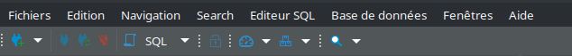

Selectionner MariaDB

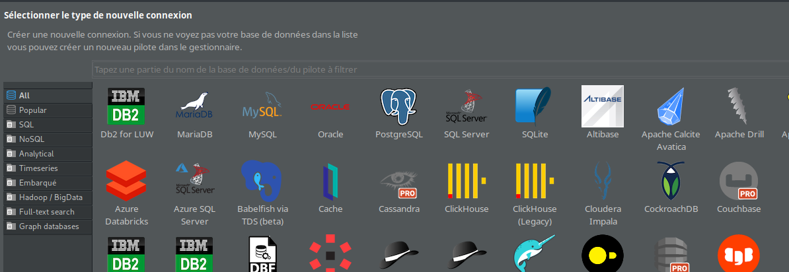

Puis mettre tous les resnseignements pour se connecter (user, password, cle ssh, port adresse de la BDD, ... )

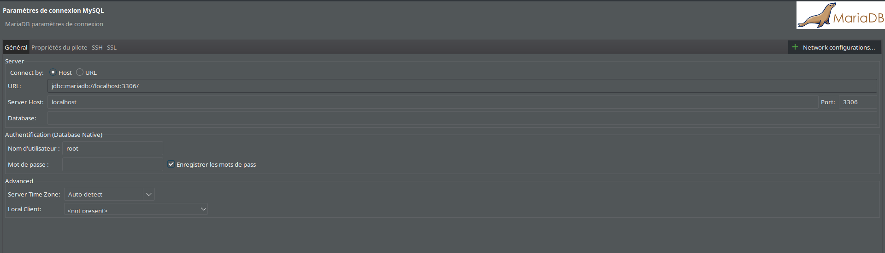

On va pouvoir créer/modifier et faire quelque requête SQL grâce à ce logiciel.

## Création d'une base de données

Avec DBeaver 2 méthodes pour créer des bases de données, le script SQL ou les fonctions faciles de DBeaver.
Méthode facile : dérouler votre connecteur puis clic droit sur Database ou base de données puis créer base de données
Ensuite donner lui un nom configurer les caractères (UTF 8 16 32 ACII ...).
Plus d'info [ici](https://en.wikipedia.org/wiki/List_of_Unicode_characters){target="_blank"}.

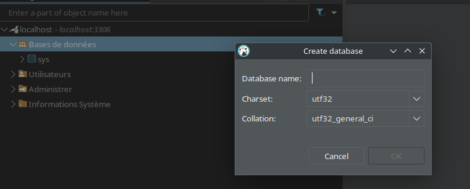

Vous pouvez aussi créer un script SQl menu Editeur SQL -> Nouveau script.

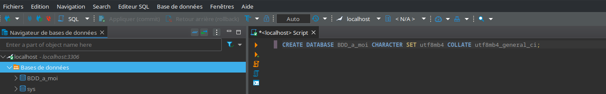

Les deux méthodes marchent. Les scripts peuvent être utiles si vous avez besoin de répéter plusieurs fois la même opération.
Félicitation, vous venez de créer votre première base de données. (votre premier fichier Excel)

## Les tables

À titre de comparaison, vous avez maintenant une base de données vides, on va la remplir avec des tables.
Sous Excel vous créer des feuilles de calcul pour les remplir avec vos données dans votre ficher.
Commençons par notre première table Client.
Vous pouvez sois utiliser les fonctions de Dbeaver sois taper du script.
Clic droit sur tables, créer une nouvelle table puis remplisser les informations.
Clic droit dans la fenêtre à droite pour créer des colonnes (une colonne ID en clé primaire unsigned int et 2 autres en varchar pour nom et prenom)

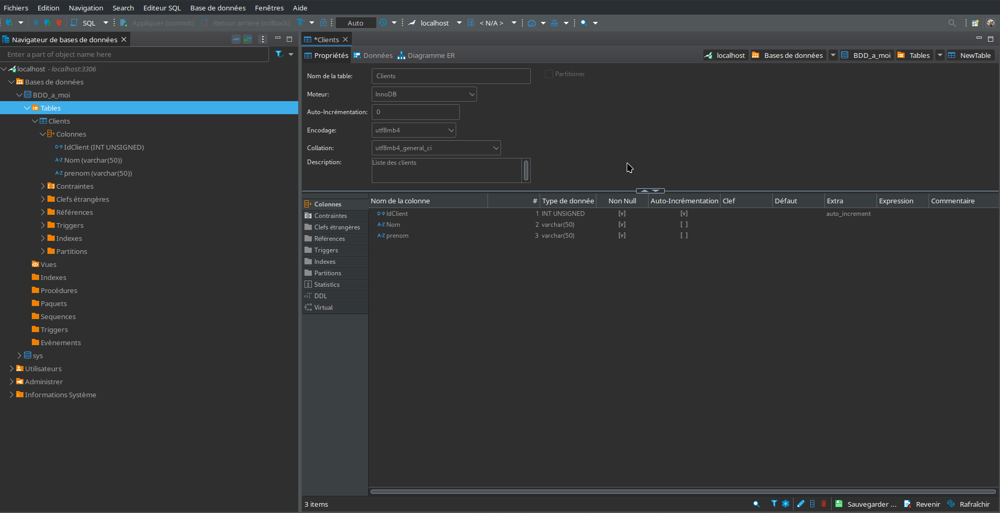

Alors la "magie de DBeaver" cliquer sur sauvegarder et appliquer en bas à droite et il vous donne le script à appliquer.

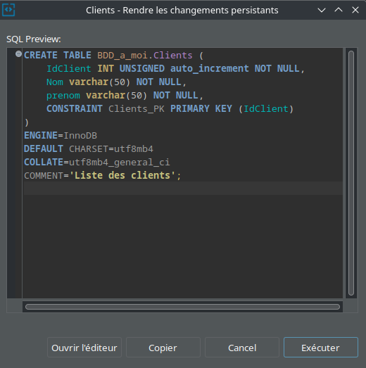

Sauvegarder le script pour une utilisation répétitive le modifier ou juste l'appliquer.
Mettre des lignes en éditant les données. Onglet données clic droit dans la première colonne avec les numéros editer-> ajouter une ligne.

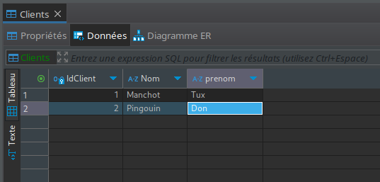

On peut créer une table achat pour savoir ce qu'on acheter les clients.

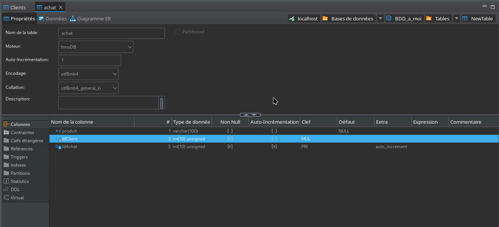

On crée une clé primaire pour retrouver les achats et une clé étrangère pour lier la table client et achats.

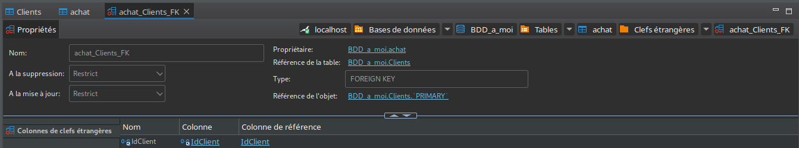

Vous pouvez importer les données à la main, ou importer les données avec des fichiers csv, avec DBeaver.
Par exemple clic droit sur la table importer ou exporter les données.

Félicitation, vous avez créé vos premières tables.

## Les requêtes SQL

Les requêtes servent à calculer,chercher, ajouter, ...
C'est comme les formules sur Excel.
Personnellement, je les utilise sois pour faire du dévelopement (site web, script automatique), sois pour faire un tableau du bord (grafana, powerBI, ...).
Commençons par une première requête pour voir.
Cliquer sur la base de données puis selectionner nouveau script. (ça permet de selectionner la base de données, sinon utilise USE DATABASE dans le script).

```SQL
SELECT prenom FROM Clients;
```

Cliquer sur les fléches pour exécuter la requête une sortie devrait apparaître en bas.

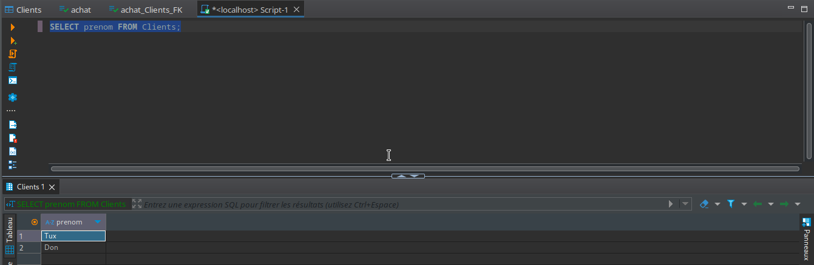

Analysons la requête :

- SELECT colonne : sélectionne la colonne ou les colonnes séparées par une virgule, * si vous voulez toutes les colonnes
- FROM table : sélectionne dans quelle table vous voulez faire la requête
- ; : indique la fin de la requête.

Alors comment faire pour extraire le nom du client avec les produits achetés ?
Il faut faire une [jointure](https://sql.sh/cours/jointures){target="_blank"} (les fameuses clés servent à ça).
Si les clés fonctionnent, DBeaver vous donne un aperçu dans le diagramme ER:

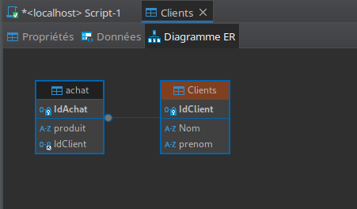

Donc taper dans le script et exécuter:

```SQL
SELECT * FROM achat 
JOIN Clients ON BDD_a_moi.Clients.IdClient = BDD_a_moi.achat.idClient;
```

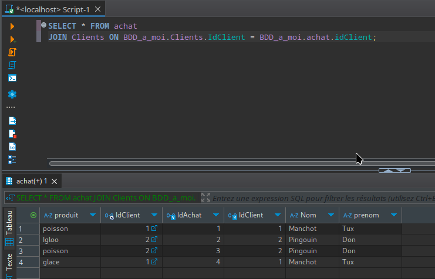

Vous ne voulez que les achats de poissons ?
Rajouter

```SQL
WHERE produit = "poisson"
```

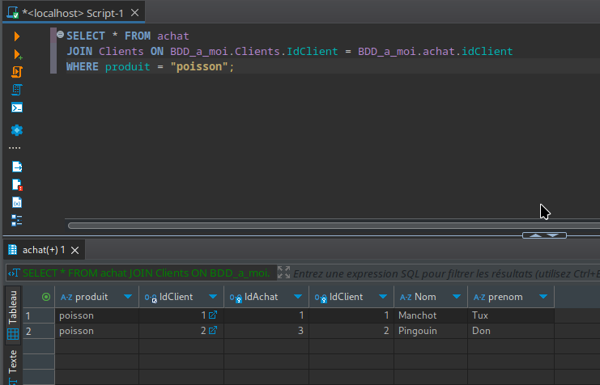

Il existe d'autres fonctions en SQL pour aller plus loin, je vous conseille le site [https://sql.sh/](https://sql.sh/){target="_blank"}

## Conclusion

Alors j'ai déjà entendu :
C'est bien beau, mais je sais tout faire sur Excel, pourquoi utiliser une BDD?
Un fichier Excel va être bloqué à chaque écriture/lecture. Donc il est accessible à une personne à la fois. (ça change avec le cloud)
On peut, avec les BDD, les dupliquer, faire des redondances pour avoir une BDD disponible à 100 % .
Mais s'il faut retenir une chose : **les BDD sont fiables.**

Pour rappel, les données d'un fichiers Excel ne peuvent pas dépasser
[certaines limites.](https://support.microsoft.com/en-us/office/excel-specifications-and-limits-1672b34d-7043-467e-8e27-269d656771c3){target="_blank"}
Donc j'espère par exemple que vous dépasserez le million de vente. Mais éviter de les enregistrer avec Excel vous risquer de tout perdre.
Comme les Anglais avec leurs tests covid :
[www.theguardian.com/](https://www.theguardian.com/politics/2020/oct/05/how-excel-may-have-caused-loss-of-16000-covid-tests-in-england){target="_blank"}

Donc pour conclure : un fichier Excel c'est pour un projet de très faible envergure.
Sinon il faut passer aux bases de données.

## Ressources

[MongoDB](https://www.mongodb.com/fr-fr){target="_blank"}

[Apache Hbase](https://hbase.apache.org/){target="_blank"}

[SQL lite](https://www.sqlite.org/){target="_blank"}

[MySQL](https://www.mysql.com/fr/){target="_blank"}

[MariaDB](https://mariadb.org/){target="_blank"}

[Microsoft SQL server](https://www.microsoft.com/fr-fr/sql-server/sql-server-downloads){target="_blank"}

[PostgreSQL](https://www.postgresql.org/){target="_blank"}
