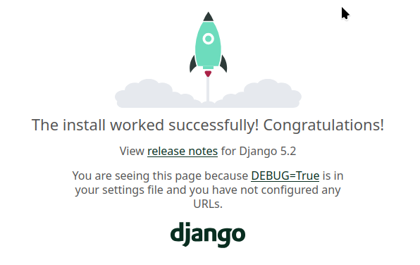

# Django

Pour un aperçu (non-exhaustif) des différents modules de [Flask](flask.md){target="_blank"}

C'est une page qui va être faite en mode agile en parallèle d'un projet que je fais.

## Installation

Soit vous utilisez votre gestionnaire de paquets, soit un environnement virtuel et pip.

Pour un environnement virtuel :

Version Linux dans un terminal :

```
python -m venv venv
source venv/bin/activate
pip install django
```

Version Windows (Troll : je conseille d'installer Linux, mais faite ce que vous voulez)

Démarrez cmd ou powershell puis tapez :

```
python -m venv venv
venv/bin/activate.bat
pip install django
```

Personnellement, je crée un fichier requirements.txt et je note tous les paquets que j'installe un par un.
Puis un 

```
pip install -r requirements.txt 
```

me permet d'installer tous les paquets. (Des outils comme [poetry](https://python-poetry.org/){target="_blank"} existe aussi).

## Démarrage d'un projet hello world

Django par rapport à Flask est plus monolithique. Il a donc une approche plus stricte que Flask. 

Il fonctionne obligatoire avec une base de données.

Le serveur de développement vous livre les fichiers statiques. Le serveur de production ne livre plus les fichiers statiques, il faut donc prévoir un serveur web.

Pour démarrer un projet django GMAO :

```
django-admin startproject GMAO
```

Cela crée un dossier GMAO avec des fichiers :

``` sh
├── GMAO
│   ├── asgi.py # Configuraton ASGI (Uvicorn)
│   ├── __init__.py 
│   ├── settings.py # config du projet
│   ├── urls.py # gestion des URL 
│   └── wsgi.py # configuration du wsgi (Gunicorn)
└── manage.py #script qui fait plein de trucs
```

Pour info : [les différences entre gunicorn et uvicorn](https://medium.com/@ezekieloluwadamy/uvicorn-gunicorn-daphne-and-fastapi-a-guide-to-choosing-the-right-stack-76ffaa169791)

Lançons le serveur de dev grâce au script manage.py:

```
python manage.py runserver 127.0.0.1:5000
```

Allons sur 127.0.0.1:5000. 



Youpi, django est installé.

## première application

```
python manage.py startapp login
```