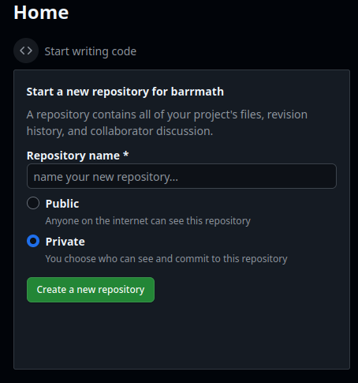
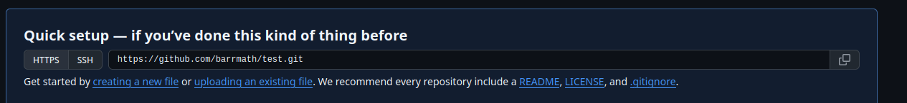
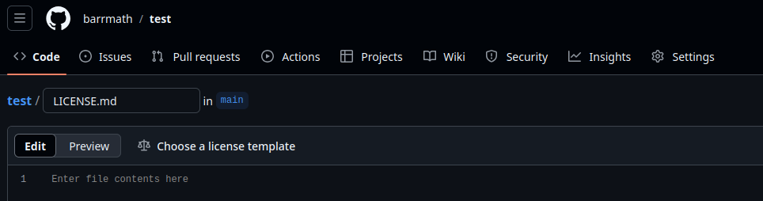
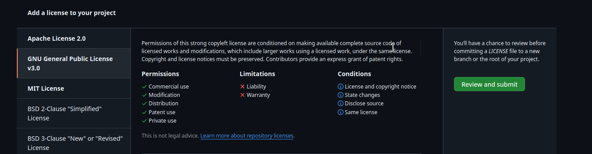
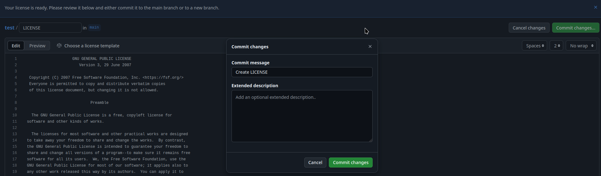
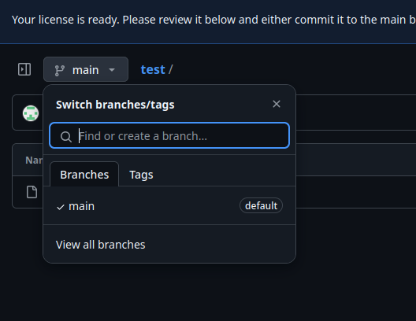
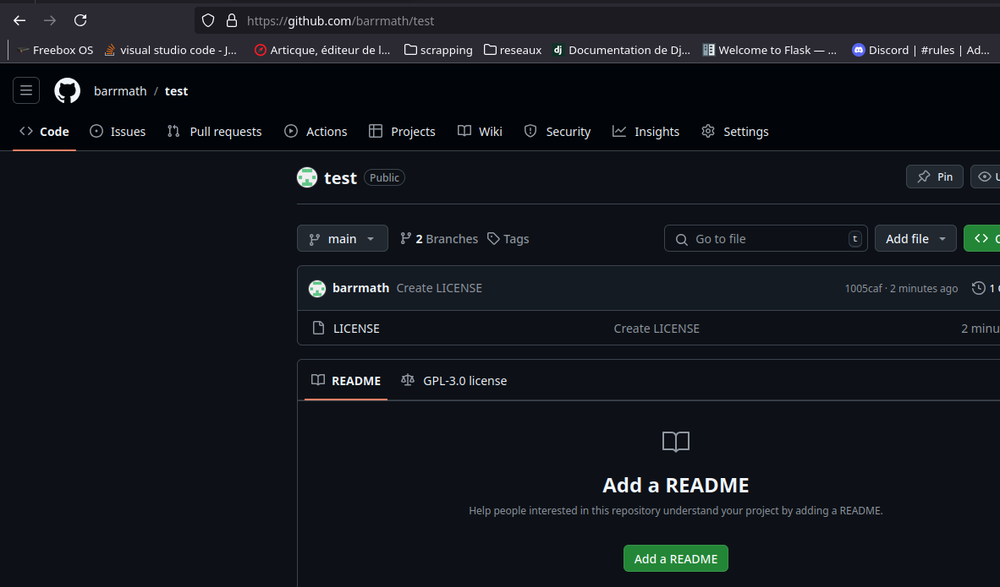

# Git

## Qu'est-ce que Git

Git est un logiciel de gestion de versionning. C'est-à-dire qu'il permet de revenir en arrière en cas de soucis. Bref une sorte de super sauvegarde.
Git est souvent associée à GitHub ou Gitlab, qui permettent de sauvegarder des projets sur le cloud.
C'est un outil qui est transversal au niveau du projet.

- Les développeurs vont utiliser git pour sauvegarder leurs travails et faire plusieurs versions.
- Les administrateurs vont utiliser git pour pouvoir déployer les projets.
- Les chefs de projets peuvent surveiller l'avancement des projets.

Pour faire simple Git est un indispensable dans le monde du développement actuel.
Au niveau de l'installation de git, sous linux utilisez votre gestionnaire de paquets (souvent Git est déjà installé). 
Pour les windosiens : [https://git-scm.com/downloads/win](https://git-scm.com/downloads/win){target="_blank"}

## Les repos Git local et "cloud"

Le Terme Cloud, je l'utilise pour que les débutants comprennent le principe. Mais git utilise le terme remote.
Vous avez en général 2 repos (ou repository ou en français dossier) le repos local ou vous travailler et le repos remote ou cloud qui est distant.
Plusieurs services de remote existent : 

- [GitHub](https://github.com){target="_blank"}
- [Gitlab](https://gitlab.com){target="_blank"}
- [Bitbucket](https://bitbucket.org){target="_blank"}
- [Framagit](https://framagit.org){target="_blank"}

Donc le dossier comprenant votre projet est disponible sur votre machine, mais aussi sur votre remote. 
On verra plus loin comment mettre à jour le remote.

## Les commits

Vous modifiez votre code, et vous souhaitez avancer d'une version. C'est un commit.
Le commit est souvent accompagné d'un message qui explique les changements effectués.
Une fois le commit fait, un numéro de commit est attribué. Celà permet de revenir sur cette version en cas de soucis.

## Les branches

Prenons directement un exemple pour expliquer les branches.
Imaginons : Robert est administrateur, il s'occupe de la mise en production. Denis est un développeur qui s'occupe du développement du site.
Pendant le développement, Denis travaille sur le site et fait des versions buguées et incomplètes du site.
Vous comprenez assez facilement que Robert ne peut pas mettre en ligne une telle version. 
Mais comment faire savoir à Robert ce qu'il peut mettre en production ou non ?

1. On peut par exemple créer trois branches : production (ou main ou master) , test et dev.
1. Denis développe et sauvegarde son travail sur la branche dev. Peut importe l'état de cette version, elle n'est pas mise en production.
1. Une fois Denis confiant dans son travail, il migre son travail sur la branche test.
1. En fonction des équipes, Robert Denis ou une autre personne peut tester l'application est validé ou non le passage en production.
1. Les tests sont OK, on passe l'application en production. On met la version de test sur la branche production.
1. Une mise à jour sur la branche de production est notifiée à Robert, il met à jour le serveur.

Voyons maintenant comment mettre en place tout ça.

## Identification et authentification sur github

Sur Gihub, les mots de passe ne permettent pas de se connecter en ligne de commande. On utilise donc sois un token sois un protocole ssh
Les protocoles changeant souvent, je vous mets un lien vers la documentation officiel : 

- [Authentification par token](https://docs.github.com/en/authentication/keeping-your-account-and-data-secure/managing-your-personal-access-tokens){target="_blank"}
- [Authentification par ssh](https://docs.github.com/en/authentication/connecting-to-github-with-ssh){target="_blank"}

## Les commandes git en ligne de commande

### git init

Entrez dans votre dossier de projet sur votre disque local puis effectuer la commande.
<pre><code class="bash">git init</code></pre>
Cela va créer un repos git local dans votre dossier.
Attention : je vois souvent des personnes faire un git init dans leur dossier personnel, voir même à la racine d'un disque.
Il s'agit d'une erreur. Effacez le dossier .git créez par git pour annuler tout le suivi. 
Puis recommencez en faisant bien attention de lancer git init dans le bon dossier

### git config

Vous pouvez modifier les paramètres de votre git. Par exemple :

```shell
git config --global user.name "Nom de l'auteur"
git config --global user.email johndoe@example.com
```

Cela va configurer votre nom et votre adresse mail. Souvent obligatoire pour faire des commits.

Le fichier .sgit/config vous permet de configurer votre repos.

### git status

Cette commande vous donne le statut de votre repos. Tout simplement. 

### git add

Permet d'ajouter un fichier ou un dossier à suivre dans votre repos. par exemple : 

```shell
git add  readme.md
```

Pour ajouter le suivi du fichier readme.md

### git commit

Permet de faire un commit.

```shell
git commit -am "message"
```

Pour faire un commit avec un message
Attention vous ne faites qu'un commit en local et pas sur le remote. Pour le faire sur le remote, il faut faire un push.

### git branch

La commande git branch permet de faire une branche.

```shell
git branch nom_de_la_branche
```

Pour faire une branche nommée nom_de_la_branche

### git checkout

Vous permet de changer de branche. 

```shell
git checkout nom_de_la_branche
```

Pour changer de branche nommée nom_de_la_branche

### git remote add origin

Vous permet d'ajouter un remote.

```shell
git remote add origin https://github.com/username/repo.git
```

Pour ajouter le remote.

### git push

Permet de faire un push. C'est-à-dire mettre les commit local vers le remote

```shell
git push origin nom_de_la_branche
```

Pour faire un push sur la branche nommée nom_de_la_branche

### git pull

Permet de faire un pull. C'est-à-dire mettre le remote vers le local

```shell
git pull <nom_de_la_branche>
```

Pour faire un pull, c'est à dire mettre à jours votre repos local avec le remote.

### git clone

Permet de faire un clone.

```shell
git clone https://github.com/username/repo.git
```

Pour faire un clone de votre repos.


## La console Github

Vous pouvez aussi utiliser la console Github. Pour gérer vos fichiers, vos branches et vos repos.
Pour les débutants, je conseille de commencer leurs projets avec la console github (Gitlab, Bitbucket et autre possèdent aussi une console)

### Débuter avec Git et Github : La méthode du débutant

Je recommande de commencer votre projet avec la console Github pour les raisons suivantes :

- Vous allez devoir créer un repos github de toute façon alors autant commencer directement.
- En créant d'abord sur github, vous allez faire suivre les dossiers et les fichiers au cours de votre développement.
- Vous allez éviter de faire un git init n'importe où.
- Vous n'aurez pas besoin de configurer le remote, il sera déjà prêt.

Connectez-vous à github et mettez un nouveau nom de repos à votre github. 
Cliquez sur private ou public si vous voulez un repos privé 
(vous seul pouvez le voir et certains collègues autorisés) ou public (tout le monde peut le voir).



Selectionnez votre licence pour votre repos



Cliquez sur choose a licence template. Ou si vous êtes doué en droit, créez votre propre licence.



Selectionnez la Licence et cliquez sur Review and submit



Puis sur le bouton commit change. Completez les messages et faite votre premier commit en cliquant sur commit changes



Créez vos branches grâce à cette fenêtre :



Cliquez sur le nom du repos (ici test)



Copier l'adresse en haut de votre navigateur puis faite un git clone

```shell
git clone https://github.com/username/repos
```

Un dossier avec le nom du repos est créé sur votre disque local.
Par défaut, vous êtes sur la branche main après un clone. Je vous conseille de changer de branche et voilà vous pouvez commencez à coder.
Commencez par créer un ficher readme.md codée en markdown pour expliquer votre repos. Github l'affiche par défaut.


## .gitignore


Encore un mot sur le fichier .gitignore . 
Certains fichiers sont générés par votre code, ou vous ne voulez pas que certaines informations soient disponibles sur github
Par exemple : vos identifiants ou vos clés
Le fichier .gitignore vous permet d'ignorer les fichiers et dossiers qui ne vous intéressent pas.
Il suffit de créer le fichier .gitignore à la racine de votre projet et de nommer les fichiers ou les dossiers à ignorer.
Par exemple :

```yaml
venv
__pycache__
.pytest_cache
```

Git va ignorer les dossiers et fichier `venv`, `__pycache__` et `.pytest_cache`

Maintenant, vous pouvez vous débrouiller avec Git et votre code.

## Ressources

[GitHub](https://github.com){target="_blank"}

[Gitlab](https://gitlab.com){target="_blank"}

[Bitbucket](https://bitbucket.org){target="_blank"}

[Framagit](https://framagit.org){target="_blank"}

[Authentification par token](https://docs.github.com/en/authentication/keeping-your-account-and-data-secure/managing-your-personal-access-tokens){target="_blank"}

[Authentification par ssh](https://docs.github.com/en/authentication/connecting-to-github-with-ssh){target="_blank"}