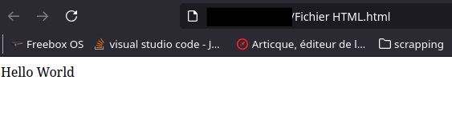

# HTML

Pourquoi apprendre le HTML (et le CSS) en 2024? Wordpress, Ionos font des sites internet en no code.
Je vais donner plusieurs raisons :

- Si voulez un site léger pour rappel une page web fait la taille de
     [Doom](https://www.clubic.com/mag/jeux-video/actualite-803876-page-web-moyenne-pese-doom.html){target="_blank"}
- Vous aimez appliquer le KISS (Keep It Simple and Stupid)
- Vous ne trouvez pas votre bonheur dans les wordpress et autres
- Vous avez besoin de récupérer des données sur des sites web (webscrapping)

Commençons par le commencement le html puis ensuite le CSS.

## HTML

Premièrement pour apprendre à faire des pages internet en pur HTML CSS vous avez besoin d'un navigateur internet et d'un éditeur de texte.
N'ouvrez pas word ou autre suite bureautique, il nous faut du texte sans fioriture.
Pour les navigateurs internet, je recommande [Firefox](https://www.mozilla.org/fr/firefox/new/){target="_blank"} 
et le [firefox pour développeur](https://www.mozilla.org/fr/firefox/developer/){target="_blank"} pour aller plus loin.
Pour les éditeurs de texte :

- Éditeur simple : [notepad++](ttps://notepad-plus-plus.org/downloads/){target="_blank"}
- Éditeur pour développeur : [vscodium](ttps://vscodium.com/){target="_blank"}


Ouvrez un éditeur de code, copier/coller le code en dessous et sauvegarder avec une extension .html.

```html
<!DOCTYPE html>
<html lang="">
  <head>
    <meta charset="utf-8">
    <title></title>
  </head>
  <body>
    <header></header>
    <main>Hello World</main>
    <footer></footer>
  </body>
</html>
```

Ensuite, ouvrez le fichier avec votre navigateur.



Félicitation, vous voilà développeur.
Analysons un peu le code. On voit des balises ouvrantes `<mot>` et fermantes  `</mot>`.
La première balise

```html
<!DOCTYPE html>
```

indique simplement qu'il s'agit d'une page HTML.

La deuxième balise ouvre le code et vous pouvez indiquer une langue.

Ensuite la balise head permet d'afficher des choses en dehors de la page comme le titre en haut. Et vous pouvez mettre des metadonnées grâce à la balise meta

charset="utf-8" permet de spécifier le jeu de caractère utilisé. (à ne pas confondre avec la police)

On arrive sur la balise body qui indique que vous travaillez sur le corps de la page html.

- head pour le haut de la page
- main pour le principal article
- footer pour le bas de page

En fonction de ce que vous voulez faire, il y a plein de balises en html. Je vous laisse les découvrir [ici.](https://developer.mozilla.org/fr/docs/Web/HTML/Element){target="_blank"}

Malgrè les balises HTML, vous trouver que votre page manque de couleur, vous voudrez avec plus de choix en placement. Le CSS est fait pour ça.

## Le CSS

Il faut lier le fichier CSS dans la page internet.

```html
<link href="style_base.css" rel="stylesheet">
```

Maintenant regardons ce que fait ce fichier.
Prenons par exemple la partie footer du css de ce site (qui auras peut-être changer entre 2) :

```css
footer{
  background-color: #333;
  padding-bottom: 100%;
  border-top:solid #8fd9fc;
}
```

Vous avez donc le nom de la balise à modifier des accolades puis des attributs (n'oubliez pas le ";" à la fin).
Ici, le fond est noir, on prend toute la place en bas (bottom) et on crée une ligne "solid" avec son code couleur.
Si vous avez plusieurs balises mais que vous ne voulez pas avoir le même comportement pas de soucis.

Ajouter class="nom" (si vous avez plusieurs balises à modifier) ou id="nom"(pour une seule balise)
Par exemple :
```html
<div class=nom_de_classe>blablabla</div>
```
et la partie CSS suivante :

```css
.nom_de_classe{
  background-color: #000;
  color: rgb(75, 255, 120);
  padding-left: 10px;
  padding-right: 10px;
}
```

La différence : le point . avant le nom indique une classe ou une id.
Vous voilà développeur front-end. (enfin presque).
Plus de fonctionnalité de CSS [ici.](https://developer.mozilla.org/en-US/docs/Web/CSS){target="_blank"}

## Ressources

[Balise HTML](https://developer.mozilla.org/fr/docs/Web/HTML/Element){target="_blank"}

[CSS](https://developer.mozilla.org/en-US/docs/Web/CSS){target="_blank}