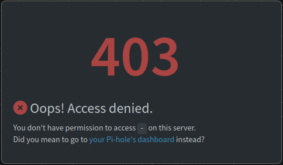
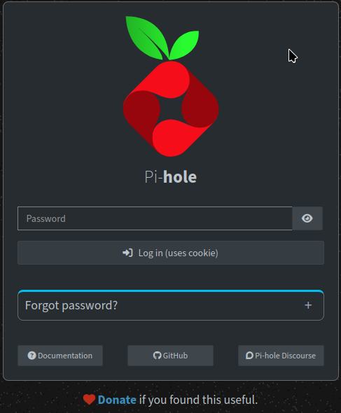
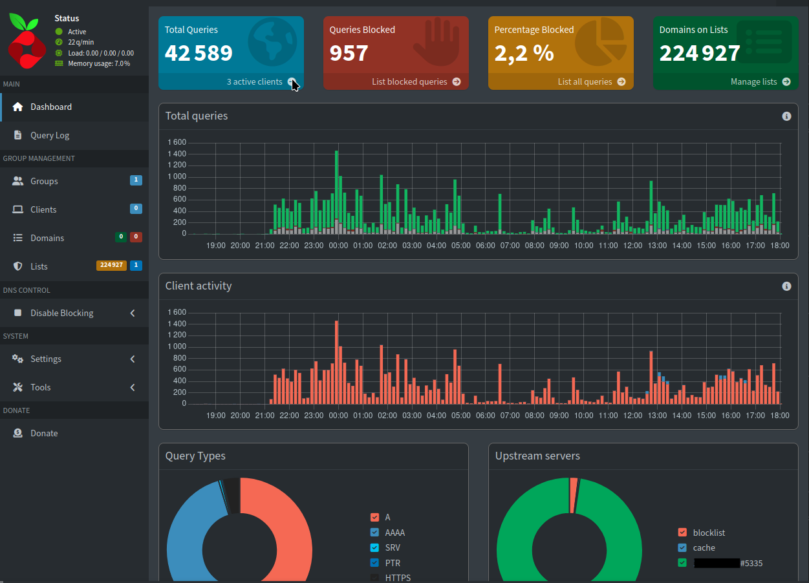
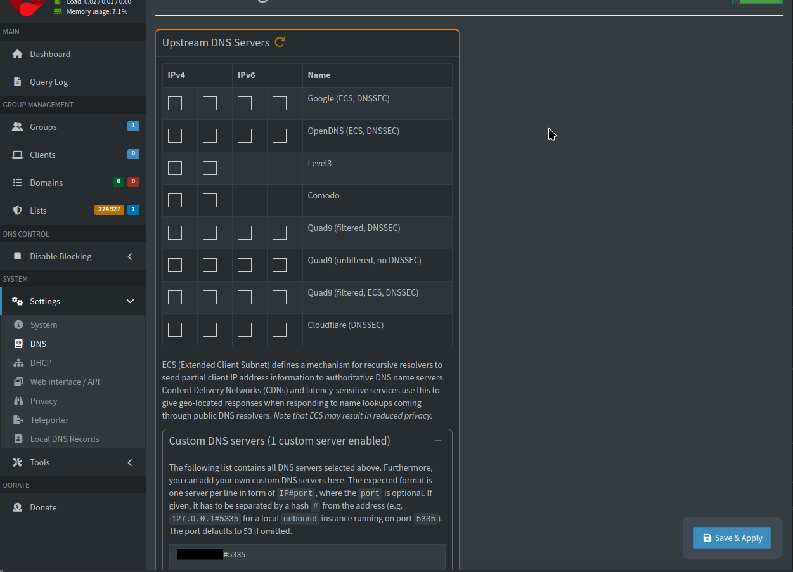
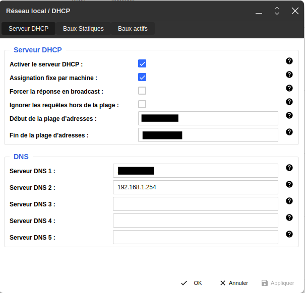

# DNS local
## Rappel rapide sur les DNS

DNS : Domain Name Server
Rapidement un serveur DNS transforme un nom de domaine (bidule.com) en adresse IP (80.55.18.22 par exemple).
Il existe de nombreux serveurs DNS dans le monde. Ceux de votre FAI, les serveurs DNS de google, et même des serveurs DNS gérés par des associations.

Je vous donne un lien vers [sebsauvage.net](https://sebsauvage.net/wiki/doku.php?id=dns-alternatifs){target="_blank"} qui est très bien si vous voulez choisir un serveur DNS sans en créer un localement.

Les DNS se renseignent auprès des registars (aussi appelé DNS racine). Lorsque que vous louez un nom de domaine, le registar mets à jour les DNS racines et les serveurs DNS recupérent votre nom de domaine et l'adresse IP associé.

Le port 53 est le port standard pour les DNS.

## Pourquoi créer son DNS local :

Un DNS local peut être utilisé pour plusieurs raisons :

- Avoir accès à des noms de domaine locaux. (Car c'est plus sympa d'avoir monitoring.local que de se rappeler l'adresse IP du serveur local)
- Pouvoir faire son propre filtrage DNS. (dans les entreprises ou pour éviter que les enfants ont accès à certains sites)
- Pour protéger sa vie privée.
- Pour contourner certaine censure

## Création du DNS local Pi-hole et unbound

Matériel : un pi 5 avec raspbian et une freebox.

Logiciel : podman et unbound (installer via les dépôts de raspbian).
Vous avez assigné une adresse Ip FIXE à votre serveur. (Via un bail statique par exemple).

Présentation rapide de Pi-hole et unbound.

Pi-hole va utiliser des serveurs DNS et vous aider pour la configuration, le monitoring et filtrage (pour les PUB, les trackers, ...)

Unbound est un resolveur DNS qui va vous transformer vos noms de domaine en adresses IP (en interrogeant de temps en temps les registars)

### Installation de Pi-hole via podman

J'ai tout simplement suivi la documentation de [pi-hole](https://docs.pi-hole.net/docker/){target="_blank"}.

Premièrement création d'un dossier pihole et de son docker-compose.
```bash
mkdir pihole
cd pihole
nano docker-compose.yml
```

Le docker compose : (un peu modifié par mes soins, n´oubliez pas de changer le mot de passe dans le docker-compose.yml) 
```yaml
# More info at https://github.com/pi-hole/docker-pi-hole/ and https://docs.pi-hole.net/
services:
  pihole:
    container_name: pihole
    image: docker.io/pihole/pihole:latest
    ports:
      # DNS Ports
      - "53:53/tcp"
      - "53:53/udp"
      # Default HTTP Port
      - "5080:80/tcp"
      # Default HTTPs Port. FTL will generate a self-signed certificate
      - "5443:443/tcp"
      # Uncomment the line below if you are using Pi-hole as your DHCP server
      #- "67:67/udp"
      # Uncomment the line below if you are using Pi-hole as your NTP server
      #- "123:123/udp"
    environment:
      # Set the appropriate timezone for your location (https://en.wikipedia.org/wiki/List_of_tz_database_time_zones), e.g:
      TZ: 'Europe/Paris'
      # Set a password to access the web interface. Not setting one will result in a random password being assigned
      FTLCONF_webserver_api_password: '1234thebestpassword'
      # If using Docker's default `bridge` network setting the dns listening mode should be set to 'all'
      FTLCONF_dns_listeningMode: 'all'
    # Volumes store your data between container upgrades
    volumes:
      # For persisting Pi-hole's databases and common configuration file
      - './etc-pihole:/etc/pihole'
      # Uncomment the below if you have custom dnsmasq config files that you want to persist. Not needed for most starting fresh with Pi-hole v6. If you're upgrading from v5 you and have used this directory before, you should keep it enabled for the first v6 container start to allow for a complete migration. It can be removed afterwards. Needs environment variable FTLCONF_misc_etc_dnsmasq_d: 'true'
      #- './etc-dnsmasq.d:/etc/dnsmasq.d'
    cap_add:
      # See https://github.com/pi-hole/docker-pi-hole#note-on-capabilities
      # Required if you are using Pi-hole as your DHCP server, else not needed
      - NET_ADMIN
      # Required if you are using Pi-hole as your NTP client to be able to set the host's system time
      - SYS_TIME
      # Optional, if Pi-hole should get some more processing time
      - SYS_NICE
    restart: unless-stopped
```

Changement par rapport au docker-compose d'origine : mon système héberge déjà un site web en http et https donc j'ai mis les port 5080 et 5443.
J'ai aussi changé la timezone et le mot de passe.

Enregistrer le fichier (ctrl+x) et lancer la commande :
```bash
podman-compose up -d
```

!!!tips
   Un message d'erreur peut venir vous expliquant que vous n'avez pas accès au port 53 via podman.
   Pas de panique, modifier le fichier /etc/sysctl.conf ajoutez à la fin du fichier : 
    ```yaml
    # for pi-hole in podman-compose
    net.ipv4.ip_unprivileged_port_start=53
    ```
    Cela permettra à podman de pouvoir modifier les ports 53 et au-dessus.


Un petit tour sur le service avec votre navigateur internet : adresse IP de votre pi et port. Par exemple 192.168.XXX.XXX:5080 ou le 5443 pour avoir un accès https.

 

Pas de panique, il suffit de cliquer sur le lien dans le message d'erreurs :



Mettre le mot de passe que vous avez modifié dans le docker-compose. Et vous devriez arriver sur ce genre d'interface :



```Warning
Chez moi pi-hole est déjà fonctionnel est configuré depuis plusieurs jours. Mais chez vous, il devrait y avoir beaucoup moins de requêtes, c'est normal.
```

Si vous ne voulez que faire du filtrage et utilisez un serveur tiers, vous pouvez aller directement à la section configuration de [pi-hole.](#config-de-pi-hole-pour-passer-via-unbound). Il vous suffira de cocher les serveurs DNS voulus.

### Installation de Unbound

Raspbian est à base de debian donc on connaît la musique : [Apt apt](https://www.youtube.com/watch?v=ekr2nIex040&list=RDekr2nIex040&start_radio=1){target="_blank"}

```bash
sudo apt update
sudo apt upgrade
sudo apt install unbound
```

Alors les nouvelles distributions installent automatiquement un service unbound-resolvconf.service.
Mais pi-hole occupe déjà le port 53, donc on le désactive.

```bash
sudo systemctl disable unbound-resolvconf.service 
```

On va ensuite dans le dossier etc/unbound/unbound.conf.d/ et on crée un fichier de config pour pi-hole.

```bash
cd /etc/unbound/unbound.conf.d/
nano pi-hole.conf

```

Et y mettre la config :
```yaml
server:
    # If no logfile is specified, syslog is used
    # logfile: "/var/log/unbound/unbound.log"
    verbosity: 0

    interface: 127.0.0.1
    port: 5335
    do-ip4: yes
    do-udp: yes
    do-tcp: yes

    # May be set to yes if you have IPv6 connectivity
    do-ip6: yes

    # You want to leave this to no unless you have *native* IPv6. With 6to4 and
    # Terredo tunnels your web browser should favor IPv4 for the same reasons
    prefer-ip6: no

    # Use this only when you downloaded the list of primary root servers!
    # If you use the default dns-root-data package, unbound will find it automatically
    #root-hints: "/var/lib/unbound/root.hints"

    # Trust glue only if it is within the server's authority
    harden-glue: yes

    # Require DNSSEC data for trust-anchored zones, if such data is absent, the zone becomes BOGUS
    harden-dnssec-stripped: yes

    # Don't use Capitalization randomization as it known to cause DNSSEC issues sometimes
    # see https://discourse.pi-hole.net/t/unbound-stubby-or-dnscrypt-proxy/9378 for further details
    use-caps-for-id: no

    # Reduce EDNS reassembly buffer size.
    # IP fragmentation is unreliable on the Internet today, and can cause
    # transmission failures when large DNS messages are sent via UDP. Even
    # when fragmentation does work, it may not be secure; it is theoretically
    # possible to spoof parts of a fragmented DNS message, without easy
    # detection at the receiving end. Recently, there was an excellent study
    # >>> Defragmenting DNS - Determining the optimal maximum UDP response size for DNS <<<
    # by Axel Koolhaas, and Tjeerd Slokker (https://indico.dns-oarc.net/event/36/contributions/776/)
    # in collaboration with NLnet Labs explored DNS using real world data from the
    # the RIPE Atlas probes and the researchers suggested different values for
    # IPv4 and IPv6 and in different scenarios. They advise that servers should
    # be configured to limit DNS messages sent over UDP to a size that will not
    # trigger fragmentation on typical network links. DNS servers can switch
    # from UDP to TCP when a DNS response is too big to fit in this limited
    # buffer size. This value has also been suggested in DNS Flag Day 2020.
    edns-buffer-size: 1232

    # Perform prefetching of close to expired message cache entries
    # This only applies to domains that have been frequently queried
    prefetch: yes

    # One thread should be sufficient, can be increased on beefy machines. In reality for most users running on small networks or on a single machine, it should be unnecessary to seek performance enhancement by increasing num-threads above 1.
    num-threads: 1

    # Ensure kernel buffer is large enough to not lose messages in traffic spikes
    so-rcvbuf: 1m

    # Ensure privacy of local IP ranges
    private-address: 192.168.0.0/16
    private-address: 169.254.0.0/16
    private-address: 172.16.0.0/12
    private-address: 10.0.0.0/8
    private-address: fd00::/8
    private-address: fe80::/10

```

!!!tips
    Des fois, IPv6 marche pas donc vous pouvez la desactiver dans ce fichier. do-ipv6: yes, mettre no.

Voilà pour la config de unbound.
On va maintenant passer à la config de pi-hole.

### Configuration de pi-hole pour passer via unbound

Alors dans le menu sur le côtés droit on va dans Settings->DNS


Cochez ou décochez les DNS que vous voulez ou pas.
Ensuite, ajoutez votre serveur Unbound (Qui regarde le port 5335 si vous n'avez pas changé la config de unbound) dans la fenêtre en-dessous (il faut cliquer sur le +).

adresse IP de votre serveur une dièse et le port.
exemple: 192.168.1.225#5335
et cliquez sur **save and apply**

!!!tips
    Votre raspberry a déjà une synchro horaire via un serveur. Vous pouvez desactiver les serveurs ntc en activant le menu expert en cliquant sur le bouton-slide "Basic".

### Exemple de config de la machin-box

Vous avez un serveur DNS mais personne va dessus.
2 choix, faire la configuration machine par machine.
Ou configurer le routeur.

Votre box posséde un routeur DHCP, modifier la box et ajouter votre serveur DNS.
!!!Warning
    Notez avant d'éffacer la configuration de la box. En cas de mauvaise manip vous ourrez revenir en arriére.

Exemple chez free :



!!!tips
    Copier-coller le DNS d'origine en deuxième position, en cas de panne de votre serveur DNS vous aurez encore une accès internet

Retournez sur l'interface de pi-hole, les requêtes devraient passer par celui-ci. (redémarrage des PC peut-être nécessaire)