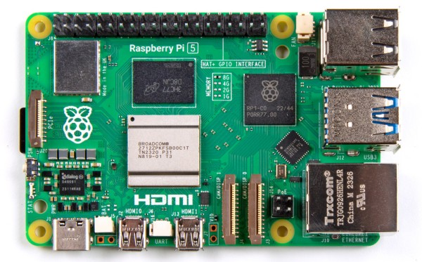
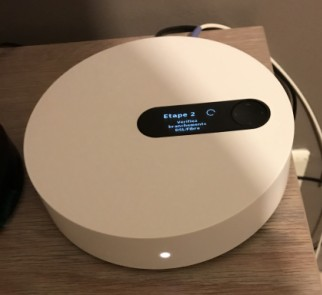
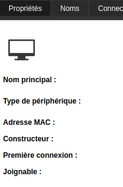
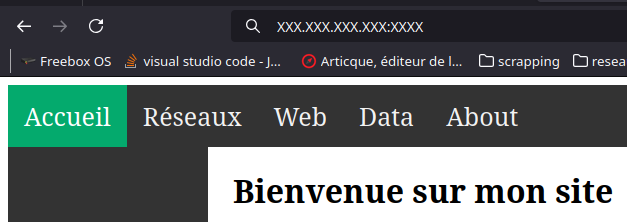
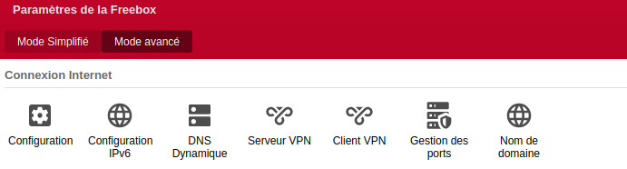
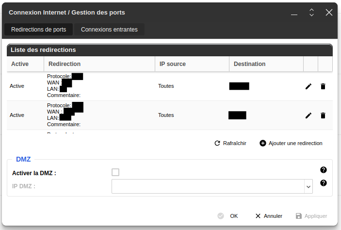
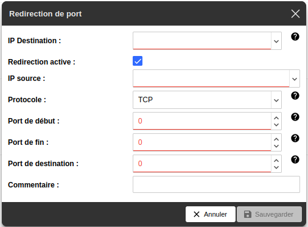
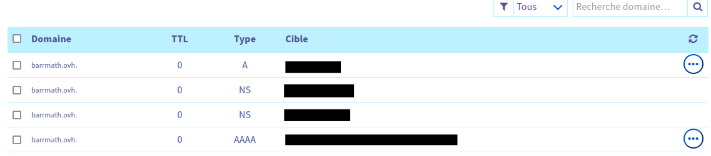

# Auto-Hébergement

Le but de cette page est de vous décrire comment héberger votre petit site web chez vous.

Matériel :

- Un routeur (ou une machin-box).
- Une adresse IP statique avec les ports 80 et 443 disponibles.
- Un ordinateur pouvant servir de serveur.
- Du temps.

Pour le serveur, j'ai utilisé un Raspberry pi 5 avec Rasbian. Ma machin-box est une freebox Pop.

{width=200 align=left}
{width=200}


Alors pour commencer, il faut comprendre comment on obtient une page internet à partir d'une adresse internet. Je vous ai préparé le schéma suivant :
{width=600}
{width=600}

1. Le client demande une IP lié à adresse internet aux serveurs DNS.
1. Le serveur DNS envoie une adresse IP.
1. Le client demande au serveur, situé à l'adresse IP, la page internet.
1. Le serveur envoie la page demandée.
1. Le client affiche la page.

Je considère que vous avez déjà un site internet, sinon vous pouvez utiliser ce site ou un hello world.
Vous pouvez trouver le code de ce site [ici.](https://github.com/barrmath/piweb2){target="_blank"}

Vous pouvez trouver un hello world pour un site html [ici.](https://www.educative.io/answers/how-to-write-hello-world-in-html){target="_blank"}

Pour effectuer cet auto-hébergement, on va y aller par étape :
    
1. Mettre le site sur le réseau local.
1. Mettre le site sur Internet en passant par l'adresse IP.
1. Configurer un nom de domaine pour associer adresse IP et nom de domaine.
    
## Mettre le site sur le réseau local.

J'utilise [Nginx](https://nginx.org/en/){target="_blank"} pour mettre en place mon site.
En cas de soucis,vous pouvez trouver un tuto [ici.](http://nginx.org/en/docs/beginners_guide.html){target="_blank"}

La commande pour l'installer est simple :

```shell
apt-get install nginx
```

modifier le fichier etc/nginx/nginc.conf pour qu'il envoie votre site.
```nginx
http {
# plein d'option par defaut;          
    server {
        server_name  votre_nom_de_domaine.truc;
        location / {
            proxy_pass acces_de_votre_site_en_local;
        }

        #error_page  404              /404.html;
        listen 80; #port d'ecoute de nginx
```

Maintenant, il faut démarrer Nginx et le mettre en enable sur systemd.

```shell
systemctl enable nginx
systemctl start nginx
systemctl status nginx
```

Le status devrait indiquer ceci :

```shell
● nginx.service - A high performance web server and a reverse proxy server
Loaded: loaded (/lib/systemd/system/nginx.service; enabled; preset: enabled)
Active: active (running) since Sun 2024-08-25 21:46:39 BST; 1 week 0 days ago
```

Maintenant que le site est en local avec Nginx il suffit de trouver l'adresse IP de votre Serveur.
Plusieurs options s'offrent à vous :
Une commande depuis un terminal du serveur:

```shell
foo@bar: ip address
2: eth0: &lt;BROADCAST,MULTICAST,UP,LOWER_UP> mtu 1500 qdisc pfifo_fast state UP group default qlen 1000
    link/ether XX:XX:XX:XX:XX:XX brd XX:XX:XX:XX:XX:XX
    inet XXX.XXX.XXX.XXX/XXX brd XXX.XXX.XXX.XXX scope global dynamic noprefixroute eth0
        valid_lft 28628sec preferred_lft 28628sec
    inet6 XXXX:XXXX:XXXX:XXXX:XXXX:XXXX:XXXX:XXXX/XX scope global dynamic noprefixroute 
        valid_lft 86229sec preferred_lft 86229sec
    inet6 XXXX:XXXX:XXXX:XXXX:XXXX:XXXX/XX scope link noprefixroute 
        valid_lft forever preferred_lft forever
```
Pour les anciennes versions :
```shell
foo@bar: ifconfig
    eth0: flags=4163&lt;UP,BROADCAST,RUNNING,MULTICAST>  mtu 1500
    inet xxx.xxx.xxx.xxx  netmask xxx.xxx.xxx.xxx  broadcast xxx.xxx.xxx.xxx
    inet6 xxxx:xxxx:xxxx:xxxx:xxxx:xxxx:xxxx  prefixlen xx  scopeid xxxxxx&lt;global>
    inet6 xxxx:xxxx:xxxx:xxxx:xxxx:xxxx  prefixlen xxxx  scopeid xxxxx&lt;link>
```

dans le routeur :



Pour tester votre site en local, taper l'adresse IP et le port dans un navigateur si vous n'utilisez pas le port 80.




Félicitation pour cette première étape.


## Mettre le site sur Internet en passant par l'adresse IP.


Je considère que vous avez une adresse IP fullstack. Changer le port d'entrée si votre fournisseur vous interdit le port 80.

Pour faire cela 2 solutions :
Le [DMZ](https://fr.wikipedia.org/wiki/Zone_d%C3%A9militaris%C3%A9e_(informatique)){target="_blank"} ou le routage de ports.

Je vais pratiquer le plus simple, le routage de port(la DMZ n'étant pas possible avec toutes les box).
Depuis l'interface Freebox, aller dans paramètres de la Freebox puis cliquer sur Mode avancé.
Cliquer sur Gestion des ports.




Cliquer sur **ajouter une redirection** :



**IP destination** : mettre l'adresse du server (ou son nom)

cocher la **redirection active [X]**

**IP source** : mettre "toutes"

**Protocole** : TCP

**Port de début/fin** : 80

**Port de destination** : mettre votre port pour votre site(dans listen nginx)

**commentaire** :Port d'entrée serveur nginx site perso

Puis cliquer sur **sauvegarder.**

Trouver votre adresse IP soit en regardant le routeur, soit en allant sur ce site :[https://whatismyipaddress.com/fr/mon-ip](https://whatismyipaddress.com/fr/mon-ip){target="_blank"}

Ouvrir un navigateur pour tester avec l'adresse Ip indiquée puis le numero de port. adresse_IP:Numero_port

Votre site devrait s'afficher.


## Configurer un nom de domaine pour associer adresse IP et nom de domaine.


Pour les noms de domaine freebox gratuit avec un abonnement : cliquer sur nom de domaine -> ajouter un nom de domaine Freebox.
Entrer le nom de domaine souhaité puis valider. Au bout de quelques minutes, votre nom de domaine devrait être actif. (et Free configure les DNS)
Pour un vrai nom de domaine : contacter un fournisseur par exemple [OVH.](https://www.ovhcloud.com/fr/domains/){target="_blank"}
Il faudra passer par leurs DNS management pour faire pointer votre nom de domaine vers votre adresse IP.



Rapidement les types :

- **A** indique une adresse IP4 (votre serveur avec une adresse 188.125.191.200)
- **AAAA** indique une adresse IPv6 (votre serveur avec une adresse 1050:0000:0000:0000:0005:0600:300c:326b)
- **NS** Corresponds au serveur DNS

Plus d'information [ici.](https://help.ovhcloud.com/csm/fr-dns-zone-general-information?id=kb_article_view&sysparm_article=KB0063450){target="_blank"}
Si tout se passe bien, vous avez votre site en ligne.

## Ressources

[code source du site](https://github.com/barrmath/piweb2){target="_blank"}

[hello world](https://www.educative.io/answers/how-to-write-hello-world-in-html){target="_blank"}

[Nginx](https://nginx.org/en/){target="_blank"}

[DMZ](https://fr.wikipedia.org/wiki/Zone_d%C3%A9militaris%C3%A9e_(informatique)){target="_blank"}

[https://whatismyipaddress.com/fr/mon-ip](https://whatismyipaddress.com/fr/mon-ip){target="_blank"}

[OVH](https://www.ovhcloud.com/fr/domains/){target="_blank"}
