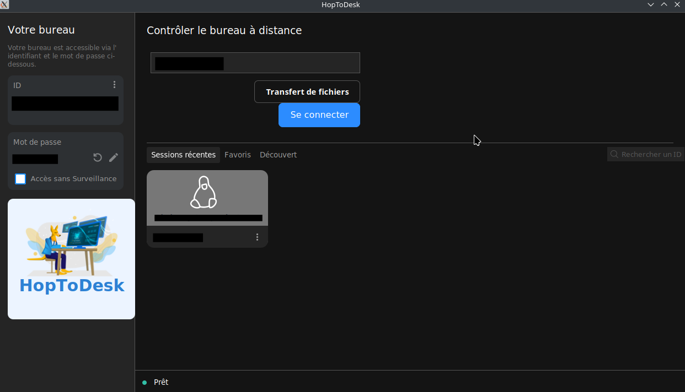

# Accès Bureau à distance

En dépannage, il est de temps en temps nécessaire de prendre le contrôle de l'ordinateur du client pour y effectuer des manipulations.
On parle d'accès Bureau à distance.

## Les différents logiciels disponibles

Petite liste non exhaustive des logiciels permettant ça :

- [VNC](https://www.realvnc.com/fr/connect/download/viewer/){target="_blank"}
- [Anydesk](https://anydesk.com/en){target="_blank"}
- [Gnome remote desktop](https://gitlab.gnome.org/GNOME/gnome-remote-desktop){target="_blank"}

Nous allons voir comment se connecter avec [hoptodesk](https://www.hoptodesk.com/fr){target="_blank"}

## Installation

### Windows

Allez sur le site, sélectionnez la version de Windows adéquate et lancez l'installation.

### Linux

Un paquet Debian existe sur le site [hoptodesk](https://www.hoptodesk.com/fr){target="_blank"}. Certaines distributions ont un dépôt (Flatpak sur manjaro par exemple)

## Utilisation

Il faut installer hoptodesk sur l'ordinateur du client et sur le vôtre pour que cela marche. Il faut aussi lancer le programme.
Une fenêtre devrait s'afficher :

Il suffit de demander au client son ID et son mot de passe pour pouvoir accéder à son bureau.