# Jenkins

## À quoi ça sert ?

Vous faites un site web, une application. Vous la developppez, mais vous en avez assez de faire le déploiement.
Jenkins peut vous aider à tout automatiser.

On va prendre un exemple simple. Mettre à jour ce site en mode automatique.

## Comment ça marche ?

Jenkins va avoir une architecture Coordinator-worker. Vous allez installer le contrôleur sur un serveur les workers ailleurs.
Si vous n'avez pas de serveur, pas de soucis personnellement, j'ai installé Jenkins sur la machine où je code.
Jenkins ayant une utilité que lorsque je code, ça parait logique.

Donc le contrôleur va donner des ordres aux workers pour effectuer les tâches de test de MAJ ou autre.

## Installation

### Contrôleur

[La documentation](https://www.jenkins.io/doc/book/installing/){target="_blank"} vous propose plusieurs façons d'installer Jenkins.
Personnellement, j'utilise le gestionnaire de paquets de ma distribution.

connectez-vous sur https:0.0.0.0:8090

user admin

mot de passe : faut le trouver.

Faites un 

```shell
sudo cat /var/lib/jenkins/secrets/initialAdminPassword
```
pour avoir le password.

Jenkins veut s'assurer que vous êtes bien un administrateur.

### Workers

Presrequis : java et une connexion ssh

Donc installez java 11 minimums (par exemple openjdk)

```shell
sudo apt-get update
sudo apt install -y --no-install-recommends openjdk-17-jdk-headless
```

et faite un dossier par exemple jenkins-worker

```shell
mkdir jenkins-worker
```

Retourner dans Jenkins puis dans administrer Jenkins puis Nodes.

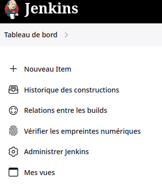

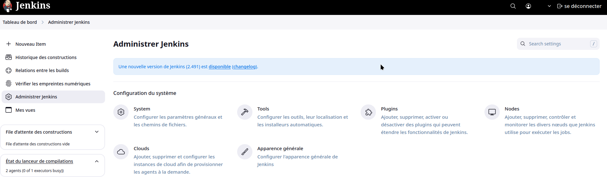

puis cliquez sur new nodes (nouveau nœud en fr)


Nommez votre noeud, je recommande nom_de_la_machine_mission

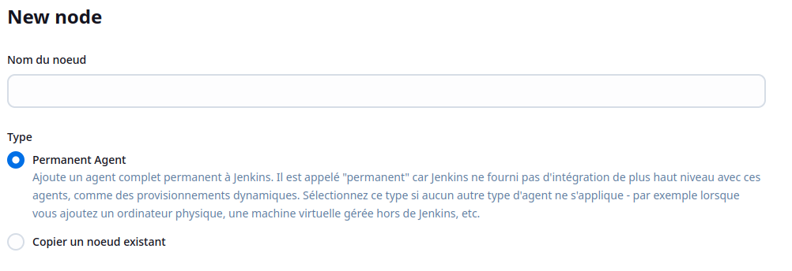

Passons maintenant à la configuration du nœud.

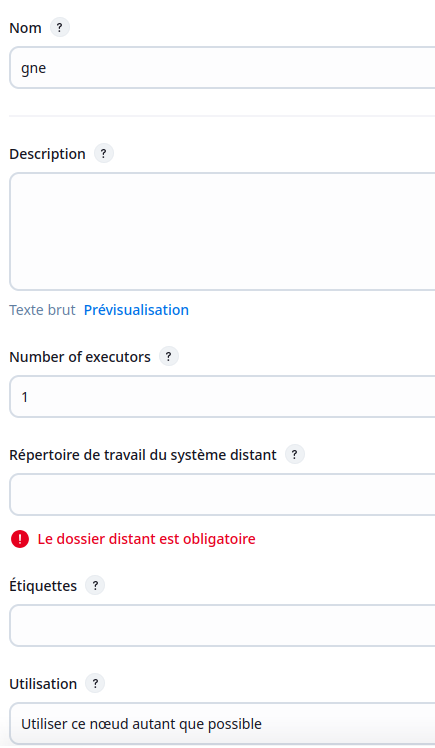

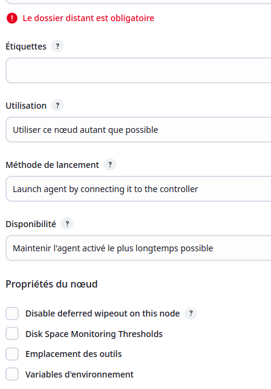

Vous pouvez entrer le dossier précédemment créé dans la case **Répertoire de travail du système distant**.

Et configurer le reste des options en fonction de ce que vous voulez faire.
Par exemple : Je configure le ssh pour la connexion dans la méthode de lancement.

Normalement, Jenkins a pu se connecter à votre nœud et ils ont synchronisé.

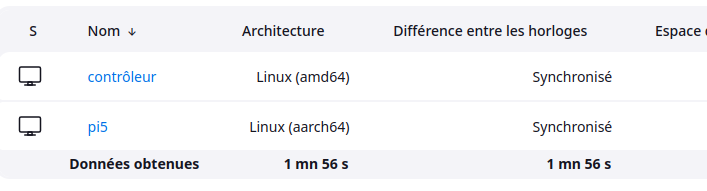

Profitez-en pour bien configurer le contrôleur, Jenkins conseille que le contrôleur ne puisse pas faire le travail d'un worker pour des raisons de sécurité.
Cliquez sur l'engrenage et passez le nombre d'exécuteurs du contrôleur à 0.

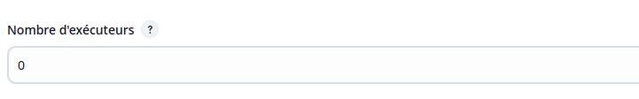

## Configuration

On a créé un controlleur un workers, maintenant on va s'attaquer au travail en lui même.
Dans le mennu cliquez sur nouveau item.


Puis selectionnez le type de projet (pour ici je prends un projets freestyle)

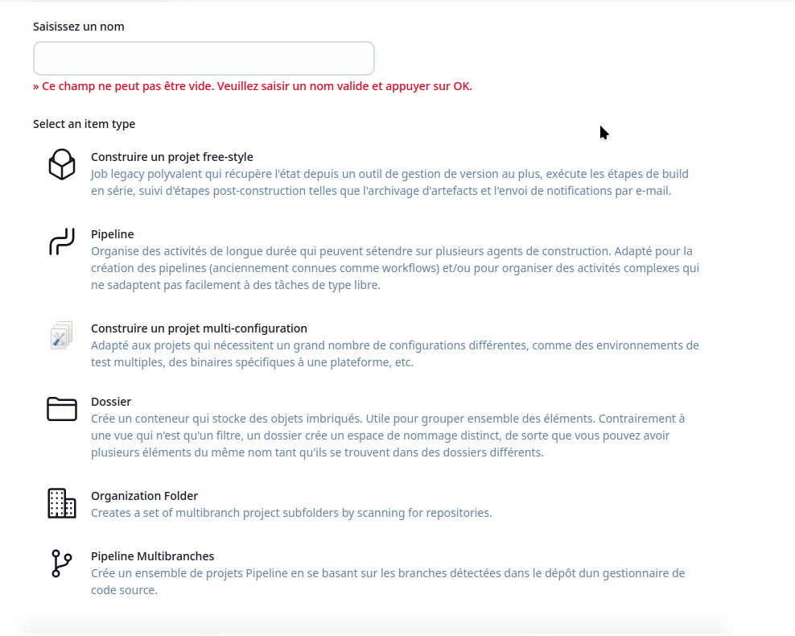

Un projet est constitué de plusieurs menus

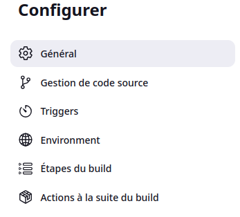

Pour ma part j'ai configuré les paramètres pour me connecté en SSH à mon serveur de deploiement. (vous pouvez aussi les mettre dans les variables d'environnement du workers)

Ensuite j'ai configurer le trigger (ou la gachette, la commande d'execution)

!!!tips
    Il faut aussi configurer un token pour l'utilisateur qui va utiliser le trigger (à ajouter dans son compte.)

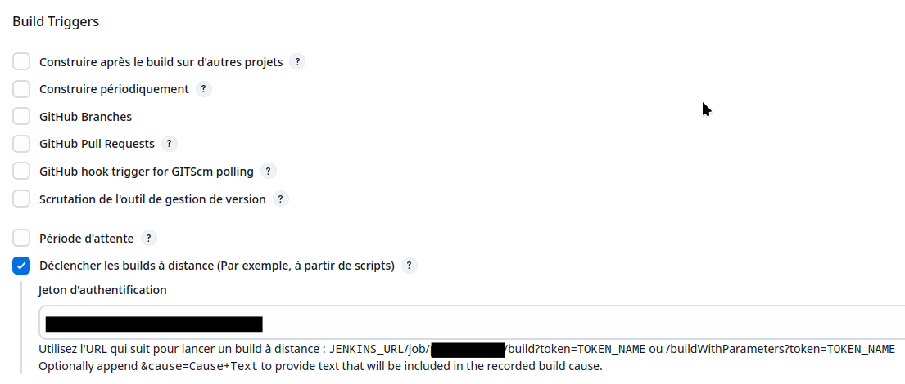

ensuite on passe au script

```as3
pipeline {
  agent any

  stages {
        stage("test"){
          steps {
            echo 'build'
                sh "sshpass -p ${params.sshpass} ssh -o StrictHostKeyChecking=no -l ${params.sshname} ${params.sshadress} -p ${params.sshport} 'cd ~/piweb && /bin/bash build.sh'"
          }
        }
        stage('deploy') {
          steps {
            echo 'Building and deploy'
            sh "sshpass -p ${params.sshpass} ssh -o StrictHostKeyChecking=no -l ${params.sshname} ${params.sshadress} -p ${params.sshport} 'sudo systemctl restart nginx'"
         }
      }
   }
}
```

Vous pouvez aussi utiliser ssh agent qui peut gerer certains credentials que vous pouvez ajouter dans la configuration de Jenkins (Jenkins credential).

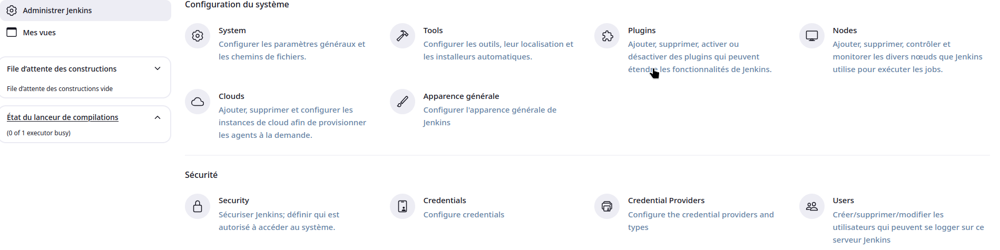

Un dernier point, des plugins existent pour Jenkins pour lui ajouter des fonctions (par exemple sshagent qui permets de faire des commande ssh dans les scripts)
Il faut être prudent avec ces plugins et les mettre à jour régulièrement.
Ma politique est d'en utiliser le moins possible pour limiter les risques de sécurité.

### meileure façon que les parametres :

Ajoutez des credentials via le menu credentials puis utilisez les avec la pipeline.

```yaml
pipeline {
  agent any

  stages {
        stage("build"){
          steps {
            echo "build"
            withCredentials([string(credentialsId: 'sshport', variable: 'sshport'),string(credentialsID: 'parametresecret2', variable: 'secret2')]){
              sh 'Truc -p $sshport -d $secret2 '
              }
          }
        }
  }
}
```
!!!warning
    Les script sh qui doivent utilisé des credential doivent utiliser les '' et nons les "" risque de sécurité
