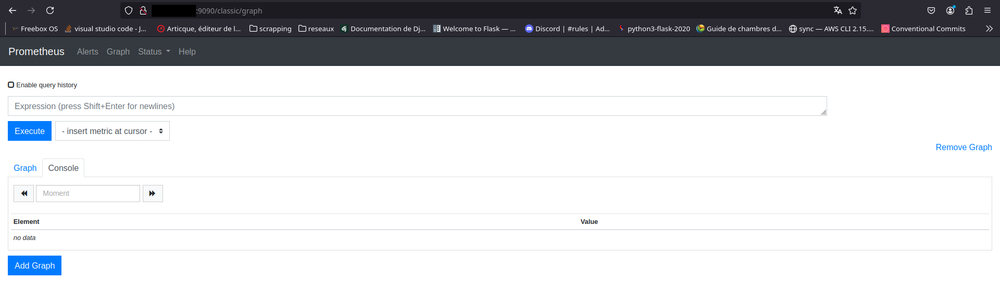
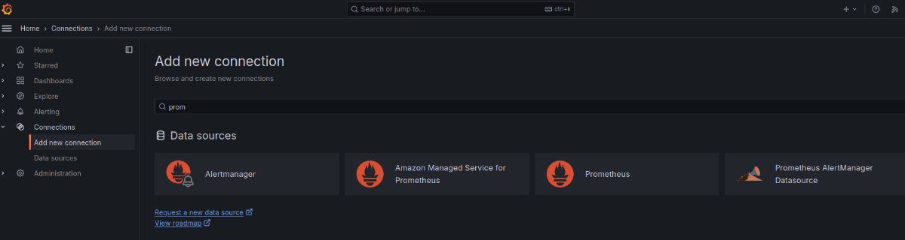
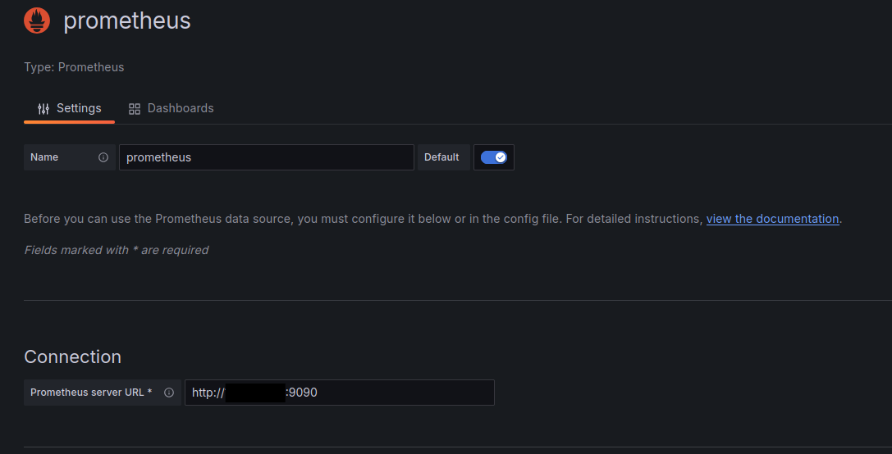
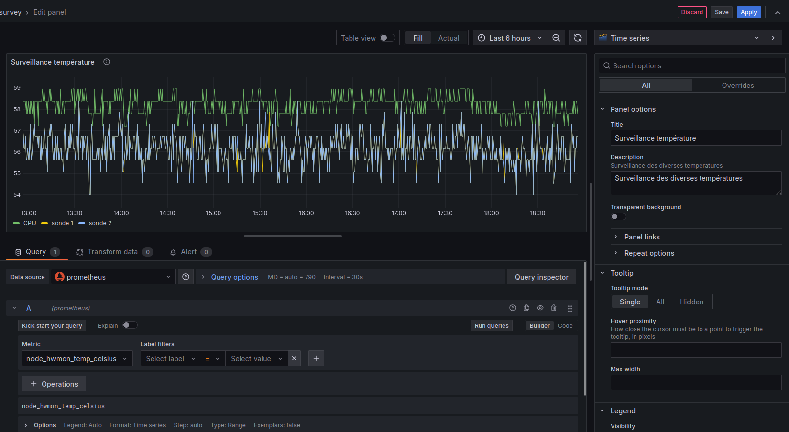
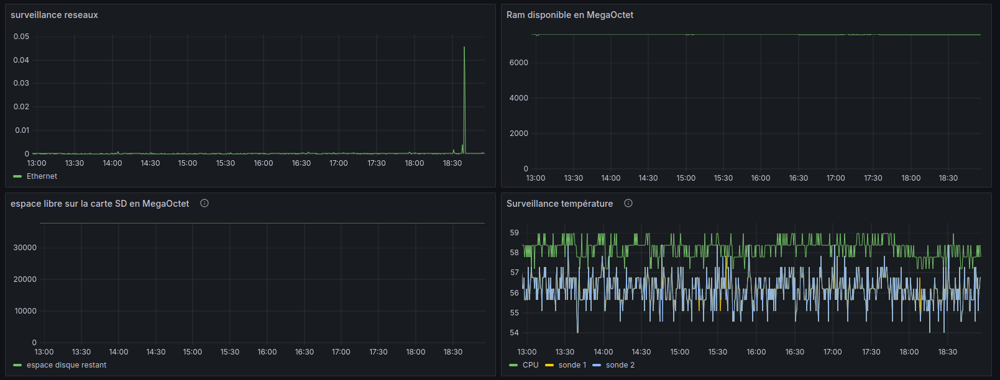

# Monitoring 

Pour surveiller le raspberry pi je vais utiliser le combo 
[prometheus](https://prometheus.io/){target="_blank"} avec
[grafana](https://grafana.com/){target="_blank"}

## Prometheus : installation et configuration.

Prometheus est présent dans les dépôts de rasbian, du coup : 

```shell
apt-get install prometheus
```

Il faut bien penser à demarrer le service 

```shell
systemctl enable prometheus
```

et vérifier son statut

```shell
systemctl status prometheus
```

La sortie devrait ressembler à ça

```shell
systemctl status prometheus
    ● prometheus.service - Monitoring system and time series database
            Loaded: loaded (/lib/systemd/system/prometheus.service; enabled; preset: enabled)
            Active: active (running) since Sun 2024-08-25 19:28:48 BST; 1 week 1 day ago
            Docs: https://prometheus.io/docs/introduction/overview/
                    man:prometheus(1)
```

Pour vérifier le fonctionnement de prometheus vous pouvez regarder avec un navigateur internet : adresse du serveur:9090/



Amusez-vous avec, faites des graphes, des alarmes en fonction de ce que vous voulez surveiller.

## Grafana : installation et configuration.

Pourquoi utiliser grafana, prometheus fait déjà des graphes ?
Imaginer que vous devez surveiller plusieurs serveurs, l'un sur aws, l'autre sur gpc, un avec prometheus, un autre sur zabbix. (franchement pourquoi faire simple quand on peut faire compliqué?).
Chacun a son petit utilitaire de monitoring, mais vous voulez tous les surveiller sur un seul tableau de bord.
Installation sur le PI:
Pas de dépôt rasbian, il faut en rajouter un.
Il y a un tuto en anglais [ici.](https://grafana.com/tutorials/install-grafana-on-raspberry-pi/){target+"_blank"}

Pour les autres, grafana est dispo dans les dépôts de Debian, Fedora et Manjaro (votre distribution doit certainement l'avoir.)
Pour les non-anglophones voilà la procèdure:

- Ajouter une clé de dépôt:

```shell 
sudo mkdir -p /etc/apt/keyrings/
wget -q -O - https://apt.grafana.com/gpg.key | gpg --dearmor | sudo tee /etc/apt/keyrings/grafana.gpg > /dev/null
```

- Ajouter le dépôt de grafana

```shell
echo "deb [signed-by=/etc/apt/keyrings/grafana.gpg] https://apt.grafana.com stable main" | sudo tee /etc/apt/sources.list.d/grafana.list
```

- Installer grafana à partir du dépôt :

```shell
sudo apt-get update
sudo apt-get install -y grafana
```

- Activer le service

```shell
sudo systemctl enable grafana-server
```

- Démarrer le service

```shell
sudo systemctl start grafana-server
```

Vous n'avez plus qu'à taper l'adresse de votre serveur et ajouter le port 3000.
Alors l´identifiant par défaut sont admin mot de passe admin. (Je vous conseille de changer.)


Une fois connecté, cliquez sur connection-> add a new connection puis cherchez prometheus.



Configurez la connection de prometheus avec vos paramètres (j'ai caché l'adresse IP de mon serveur):



Maintenant vous pouvez créer un dashboard et sélectionnez/configurez les graphiques.

{width="1000px}

En fonction de vos besoins, vous pouvez créer plus ou moins de graphiques.
Par exemple : le trafic réseaux, la ram, les températures CPU et autres, la place restante sur le disque dur :



Si vous avez des ordinateurs sous windows, vous pouvez utiliser cet agent : [OhmGraphite](https://github.com/nickbabcock/OhmGraphite){target="_blank"}

Vous pouvez aussi connecter des fichiers csv, excel pour faire un peu de data. 


## Ressources

[OhmGraphite](https://github.com/nickbabcock/OhmGraphite){target="_blank"}

[Prometheus](https://prometheus.io/){target="_blank"}

[Grafana](https://grafana.com/){target="_blank"}