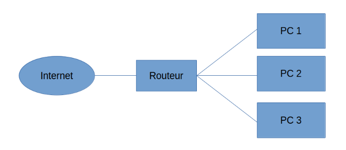
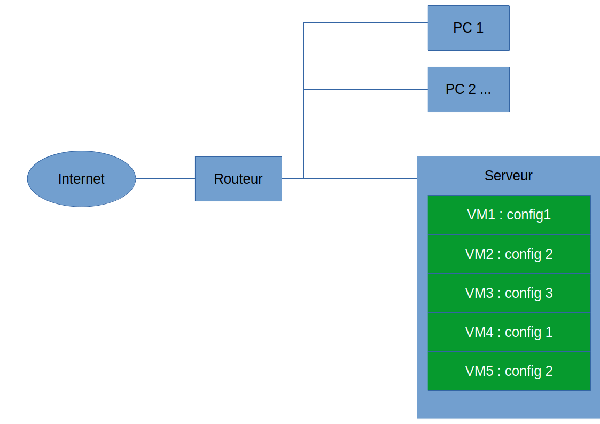
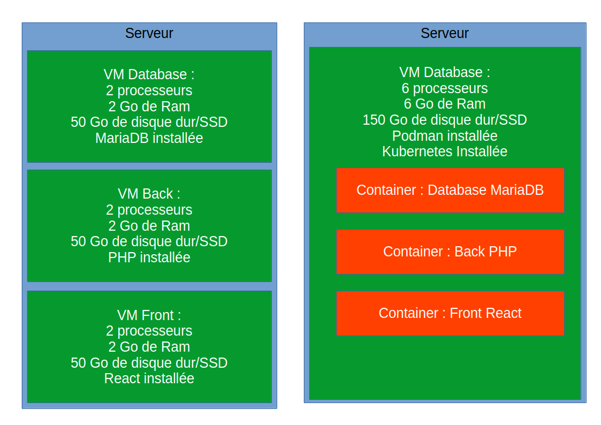

# Podman

## C'est quoi Podman?

[Podman](https://podman.io/){target="_blank"} permet de containeriser des applications. 
Un autre outil qui permet ça, c'est [Docker](https://www.docker.com){target="_blank"}.
Et personnellement, j'utilise les deux.
Mais c'est un peu court pour présenter les containers donc on va faire une sorte d'historique.    

### Des PC, plein de PC



Au tout début, on utilisait un ordinateur pour la base de données, et un autre pour l'application/serveur web.
La belle époque des systèmes monotache. Puis la technologie aidant (plus de RAM, processeur avec plusieurs cœurs).
On arriva à faire des serveurs.

### Des Machines virtuelles, plein de Machines Virtuelles



Au lieu d'avoir plusieurs ordinateurs, on a un serveur avec à l'intérieur plusieurs machines virtuelles.
On installe des superviseurs (Vmware, VirtualBox, Promox, hyperV, ...) qui découpent les serveurs en plusieurs machines virtuelles.
Une machine physique peut donc maintenant avoir plusieurs systémes d'exploitation, et un réseau avec plusieurs machines virtuelles.

Les machines peuvent avoir la même configuration entre elles ou non.
Les machines peuvent communiquer 
grâce à des [réseaux virtuels](https://www.it-connect.fr/comprendre-les-differents-types-de-reseaux-virtualbox/){target="_blank"} au sein du serveur.

### Des conteneurs, plein de conteneurs

Prochaine étape : les containers.

Les Machines Virtuelles ne sont pas forcément toutes utilisées à 100 %, le découpage du serveur n'est peut-être pas idéal.
À l'heure actuelle, 
un bon compromis est d'utiliser un serveur avec un orchestrateur de containers. Par exemple sur le cloud. (aws,gcp,azure,informaniak,...)
Vous pouvez configurer votre propre serveur de a à z, 
ou utilisez un service directement configuré ( [cloud run chez GCP](https://cloud.google.com/run?hl=fr){target="_blank"}, 
[aws EKS](https://kubernetes.io/docs/concepts/overview/working-with-objects/kubernetes-objects/){target="_blank"} ).

Les containers ont certaines limitations. 
Votre container ne fonctionne qu'avec des applications Linux. 
Lorsque vous utilisez podman ou docker sous mac ou windows vous utilisez un système Linux invité.

Schématisons un peu imaginons un système avec une DB un front end et un back end avec un serveur et 3 VM et un autre système avec des containers : 



Imaginons par exemple que la base de données grandie 
et dépasse les 50 Go. Avec les VM, on a un problème : plus d'espaces disques. Avec les containers, ça passe.

Les ressources sont partagées entre les containers. 
Mais attention tout de même si vous dépassez les ressource du serveur, vous perdez les données.

Pour utiliser podman ou docker, il faut procéder par étapes :

- Construire une image
- La sauvegarder sur un registrer (optionnel)
- Lancer un container avec une image
- Ou éventuellement utilisez un orchestrateur de containers comme docker-compose ou k8s

Ici, nous allons voir que l'utilisation locale de podman.

## Construire une image

Les commandes Docker et Podman sont quasi identiques, il suffit de remplacer podman par docker et vice-versa.
Pour contruire une image, on utilise la commande :

```shell
podman -f fichier_docker -t nom_image .
```

Vous allez créer localement une image avec la configuration incluse dans le fichier_docker. Par exemple :

```dockerfile
# image de base
FROM alpine:latest
ENV VIRTUAL_ENV=/opt/venv
# on copie l'app
COPY . /app

#on va dans le dossier de l app
WORKDIR /app
RUN apk add py3-pip npm
RUN python3 -m venv $VIRTUAL_ENV
ENV PATH="$VIRTUAL_ENV/bin:$PATH"
RUN pip install --upgrade pip && pip install -r requirements.txt
RUN npm install -g sass && sass web_app/static/scss/main.scss web_app/static/css/main.css

# on lance le serveur flask
EXPOSE 5000
CMD gunicorn -c gunicorn.conf.py
```

On commence avec une image de base (FROM) puis on ajoute des commandes (RUN) et des instructions (CMD).
On peut aussi ajouter des variables d'environnement (ENV) et des ports d'exposition (EXPOSE).
On peut aussi ajouter des volumes (VOLUME) si on veut garder des données sur le disque (exemple une base de données).

Attention, aux variables d'environnement, si vous partagez votre fichier docker sur github par exemple. Elles seront accessibles à tout le monde.
L'option --env vous permets de définir des variables d'environnement lors du lancement du container.

## Lancer un container

Sous podman crée un pod avec la commande (on l'utilisera par la suite) :

```shell
podman pod create mypod
```

Une fois l'image conStruite, vous pouvez lancer un container avec la commande :

```shell
podman run -d -p 5000:5000 nom_image
```

Si vous avez créé un pod lancer le conteneur avec la commande :

```shell
podman run -d --pod mypod -p 5000:5000 nom_image
```

- -d : lance le container "en arrière plan."
- --pod mypod : lancer le container dans le pod mypod
- -p 5000:5000 : lancer le container route le port 5000 du host vers le port 5000 du container

Vous pouvez connecter vos conteneurs entre eux en [réseaux](https://docs.podman.io/en/stable/markdown/podman-network.1.html){target="_blank"}.
Voici les commandes de base :

- podman network create podman2 : créer un réseau podman2
- podman network connect --ip 10.89.1.13 nom_containeur Nom_reseaux : connecte le container aux réseaux avec une IP fixe
- podman network inspect podman2 : affiche les informations du réseau podman2
- podman network rm podman2 : supprime le réseau podman2

Vous pouvez maintenant lancer vos containers et configurer un réseau entre eux pour que chaque container puisse communiquer avec les autres.

En cas de besoin pour entrer dans un container en mode batch + accès root.
```shell
podman exec -it -u root:root grafana /bin/bash
```

## Les pods

OK, c'est super, mais on ne va peut-être pas lancer chaque container à la main puis les connecter au réseau. 
C'est long. On peut utiliser un script bash. Ça marche bien.

On peut utiliser docker-compose (ou podman-compose) pour cela.

Sinon, on peux utiliser des pods et la fonction play kube de podman.(désolé non supporté par docker)

### Un pods, c'est quoi

C'est un groupe de containers. On ne va pas aller plus loin. Une fois vos containers lancés, et vos réseaux configurés (et vous avez testé et tout marche).

Lancez la commande :

```shell
podman kube generate Nom_du_pod -f mon_pod.yml
```

Cela va générer un fichier mon_pod.yml contenant la configuration du pod.

Pour lancer le pod :

```shell
podman play kube mon_pod.yml
```

Vous pouvez modifier les images des containers et les reconstruire. Pour mettre à jour le pod :

```shell
podman play kube mon_pod.yml --replace
```

Voilà très rapidement une explication de Podman.

## Ressources

[Podman](https://podman.io/){target="_blank"}

[Docker](https://www.docker.com){target="_blank"}